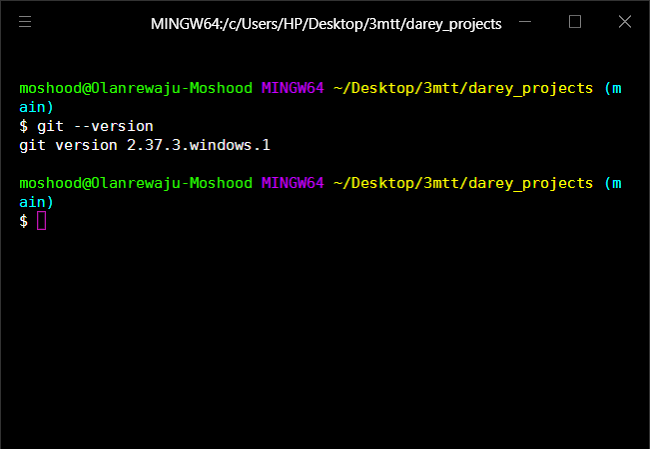

# Tech Environment Setup

## Introduction

This project is a showcase of the various application setup done on my local system in preparation for the DevOps program.
The project consist of screenshots of all the software installed.

### Visual Studio Code(VScode)

### Git Bash

### Virtualbox Welcome page

### Ubuntu on Virtualbox

### AWS Account

### Github account

