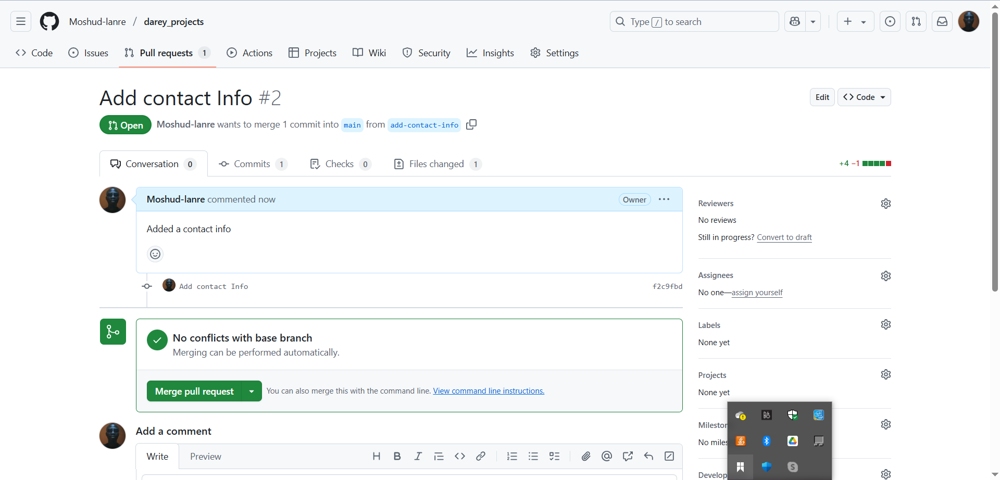

# Version Control System

## Introduction

This project is a showcase of how version control systems are utilised in software development within a team without having difficulties.
A Version Control System is a vital tool in software developemnt, designed to track and manage changes to code or documents over time. It enables multiple developers to collaborate on the same project efficiently, by controlling and merging changes made by different team members.

### Tom Changes

- Pull request : 

- 

### Jerry Changes

- Pull request : 

- Merge : 
