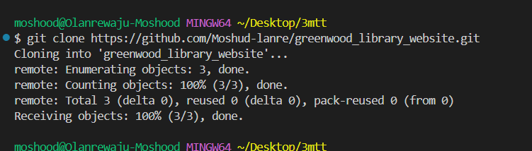
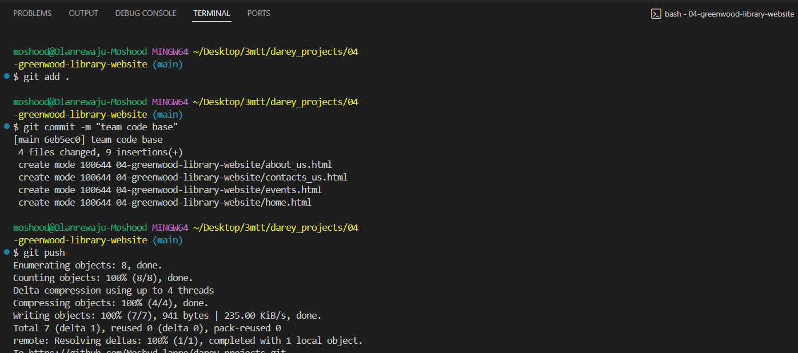
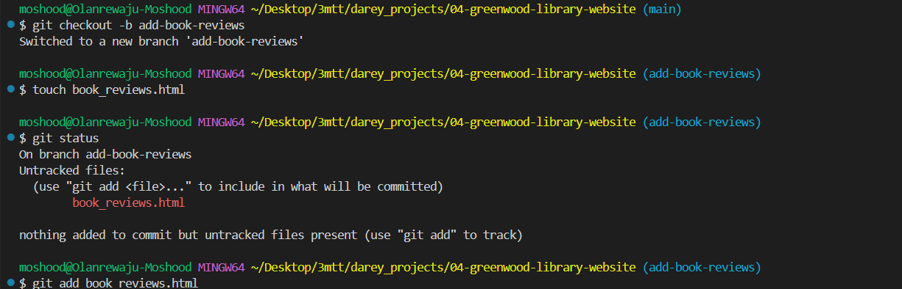
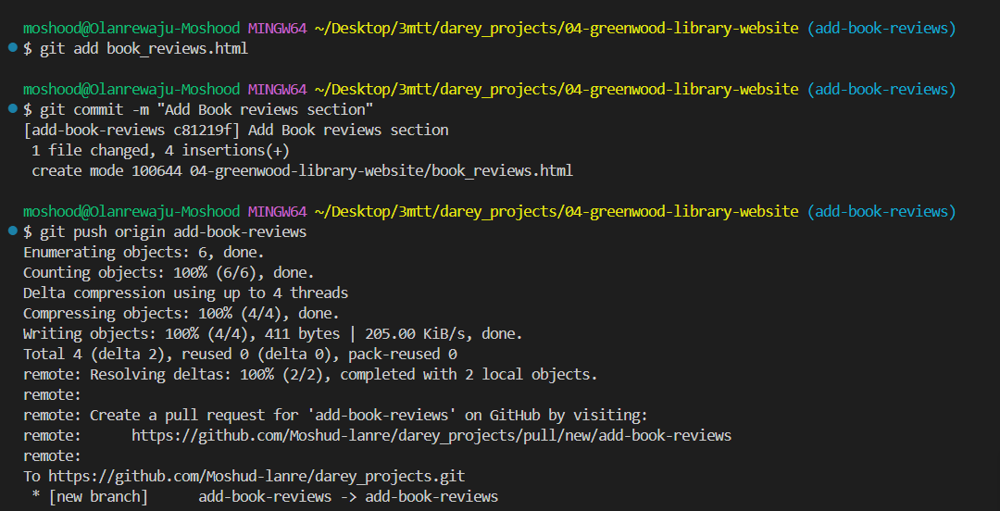
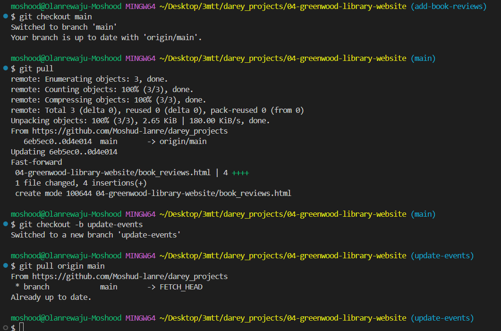
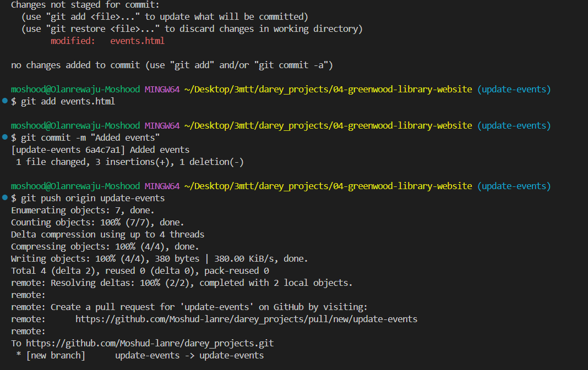
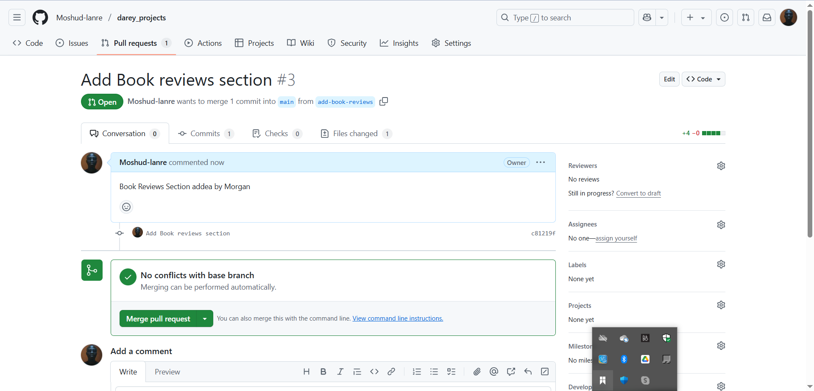
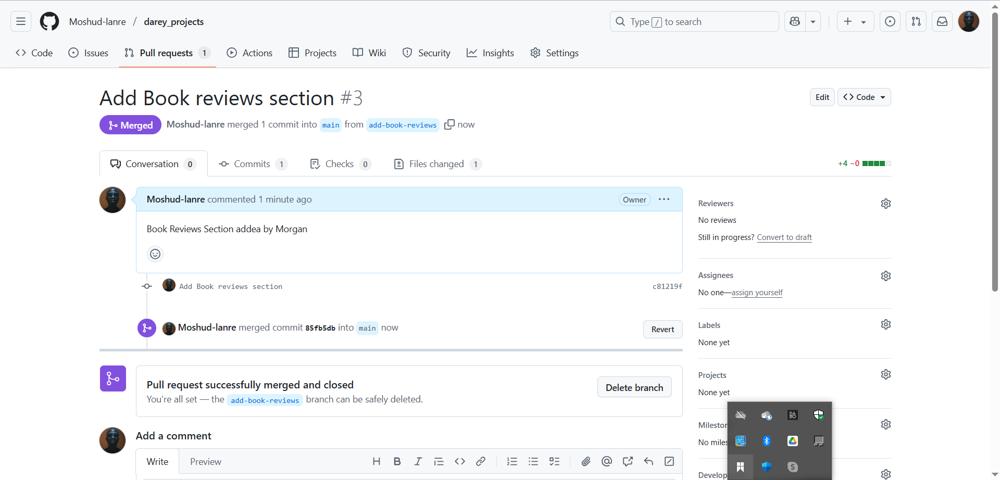
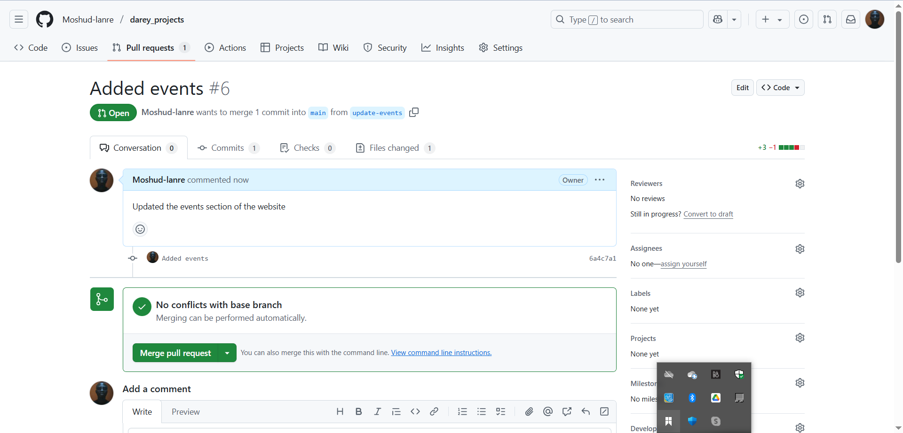
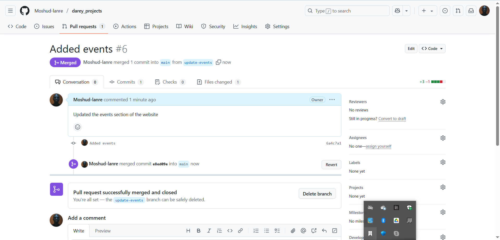

# Greenwood_library_website

This project simulates the collaboration between two software engineers with the use of GitHub.
The project involves step-by-step project to simulate workflow of Morgan and Jamie using Git and GitHub. The project includes the setting up a GitHub repository, cloning the repository, creation of branches, making changes, and merging those changes into the main branch.

### Part 1 Setup and Initial Configuration

- Create and Clone repository : 

- First commit (Team codebase) - 

### Part 2: Simulating Tom and Jerry's Work

- 1. Morgan's Work:
  - create branch 
  - Content update 
  
- 2. Jamie's Work
  - create new branch and Pull changes 
  - update events file 

### Part 3: Pull Request and Merging

- 1. Morgan's PR : 
- 2. Morgan's PR merge : 
- 3. Brach Update and Synchronization 
- 4. Jamie's PR: 
- 5. Jamie's PR merge: 

project repo link : https://github.com/Moshud-lanre/darey_projects/tree/main/04-greenwood-libbrary-website
