# Linux Commands Deep Dive

A linux command refers to a program or utility that runs in the command-line interface(CLI). The CLI is atext based environment where interactions are made with the system by typing commands.

This project seeks to demostrate various linux commands and their operations.

- 1. Creating a Folder with sudo:
  - a.Folder creation denied due permission- 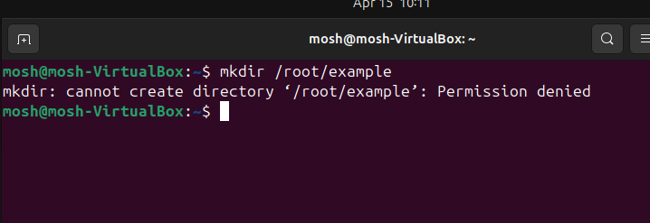
  - b.Folder creation with sudo - 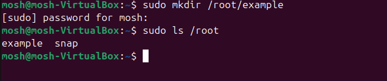

- 2. pwd command
Using pwd command to find the path of my current working directory - 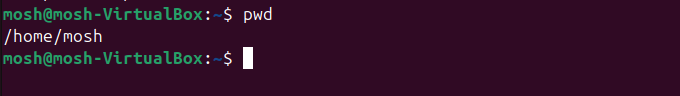

- 3. Root Directory("/")
  - a. Changing of directory to root- 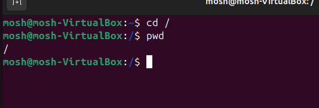

  - b. Listing directories/files in the root directory -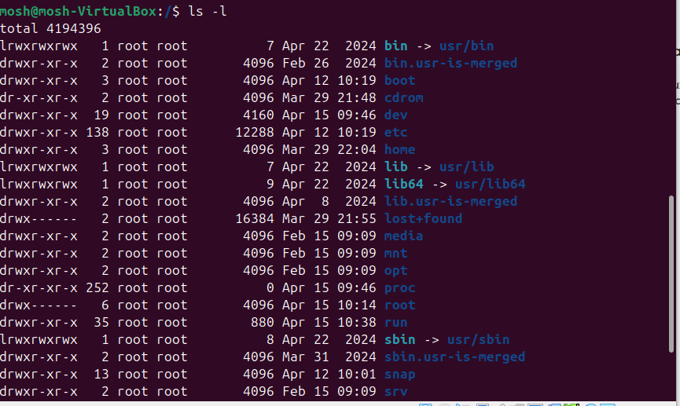

  - c. Change directory to /usr - 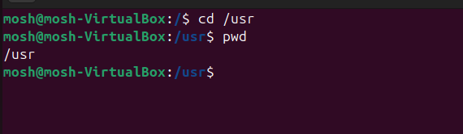

  - d. Side Hustle Task 1:
    - 1. Create  directory named photos inside the /usr directory - [photos_dir](screenshots/7-mkdir-photos.png)

    - 2.Navigate to photos and create 3 folders -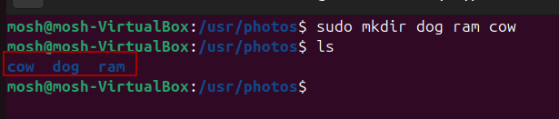

    - 3.Navigate to one of the folders & show the full path where you currently are on the screen - 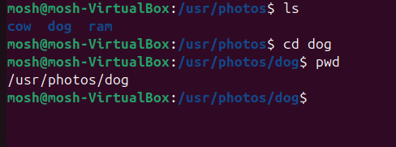

- 4.ls command
    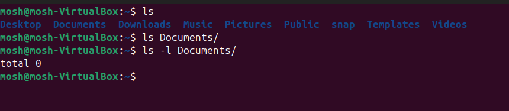

- 5.cat command
    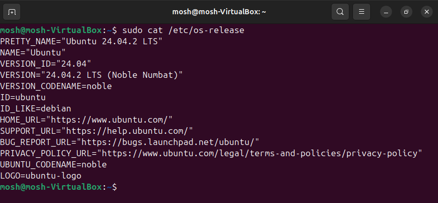

- 6.cp command
  - 1.Copy file into a directory - 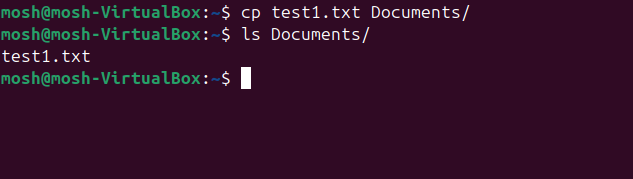
  - 2.Copy the content of a file to new file in the same directory - 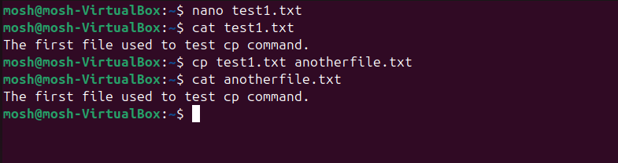
  - 3.Copy an entire directory - 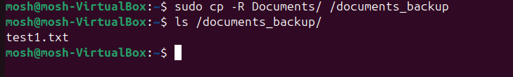

- 7.mv command
  - 1. move file into another directory - 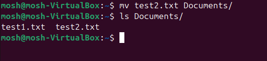
  - 2. move and rename file - 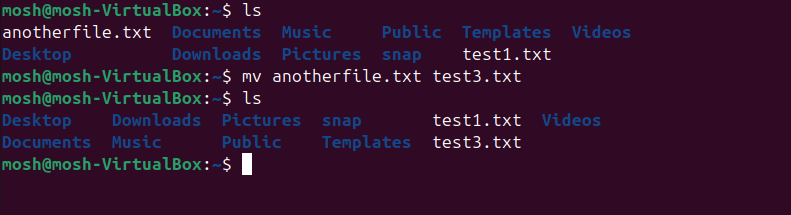

- 8.rm command
    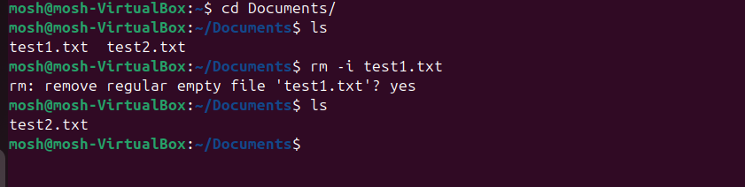

- 9.touch command
    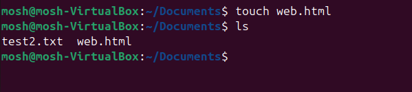

- 10.find command
    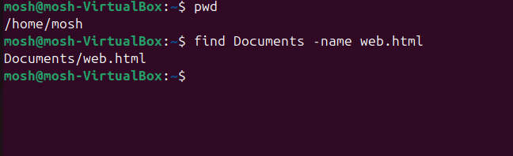

