# Linux Text Editors

Linux text editor is a software application specifically designed for creating, modifying, and managing text files on a Linux-based operating system. Text editors play a crucial role in the Linux environment, providing a means for users to interact with and manipulate plain text files, configuration files, scripts, and other text based documents.

This project seeks to demonstrate some text editors by exploring their features.

## Vim Text Editor

The Vim text editor is a powerful and versitile text editing tool deeply ingrained in the Unix and Linux ecosystem. Vim builds upon the foundation of the origial Vi editor, offering an extensive set of features, modes, and commands that empower users to manipulate efficiently. Below is are screenshots of demo done when exploring Vim:

- 1. Open a new file - vim exercise.txt
    The command creates a 'exercise.txt' file even if it doesn't exist. Then it opens the file up so that we can start writing into it.
    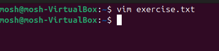

- 2. Insert Mode -  Pressed letter i on the keyboard to enter insert mode.
    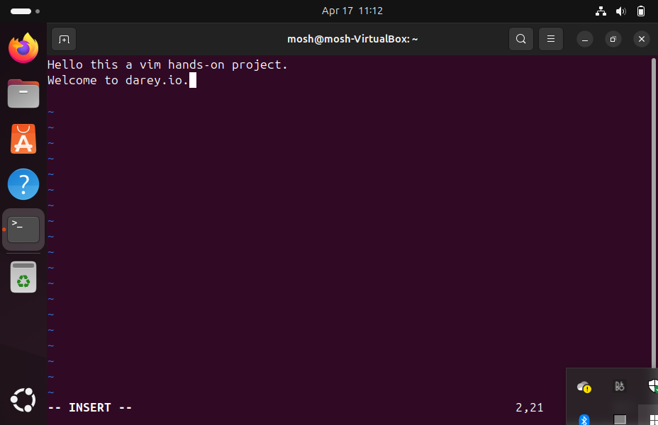

- 3. Moving Around: Moved around the editor with the arrow keys/ h(left), j(down), k(up), and l(right).

- 4. Deleting a Line: Deleted an entire line in the file by pressing 'd' twice on the keyboard.
    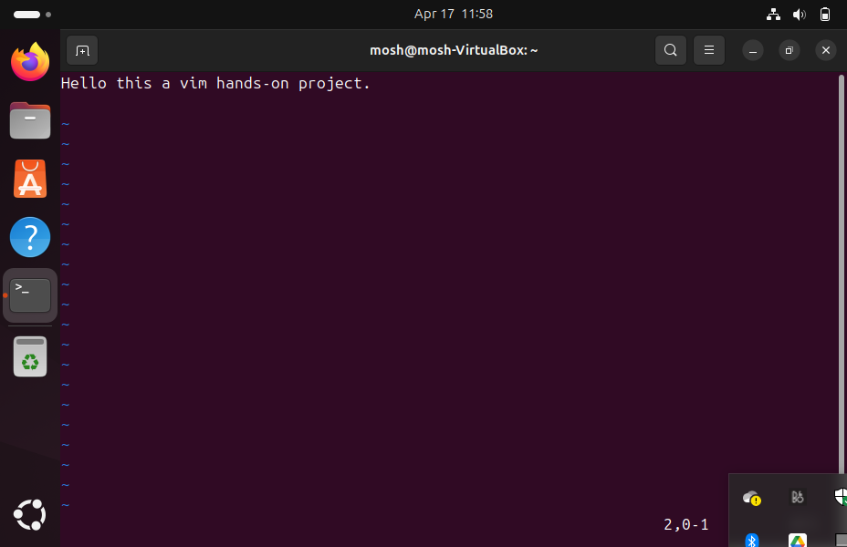

- 5. Undoing Changes: Undone a change by pressing 'u' on the keyboard.
    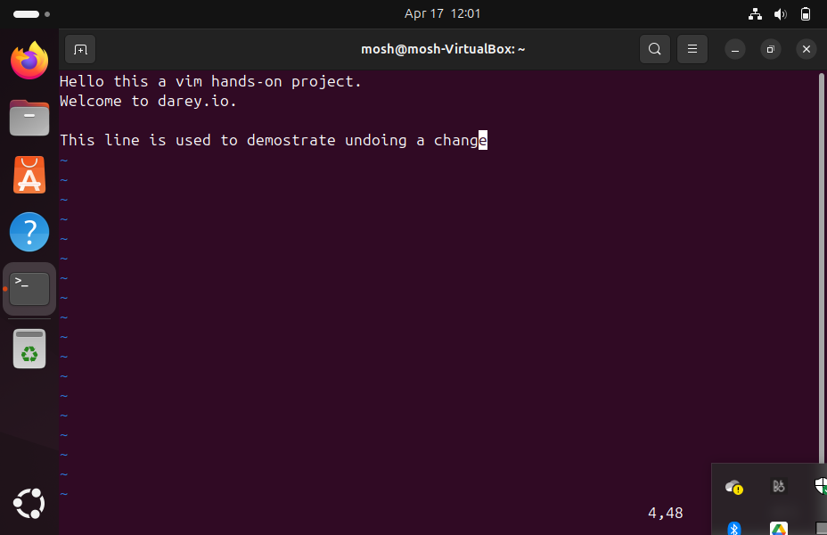

    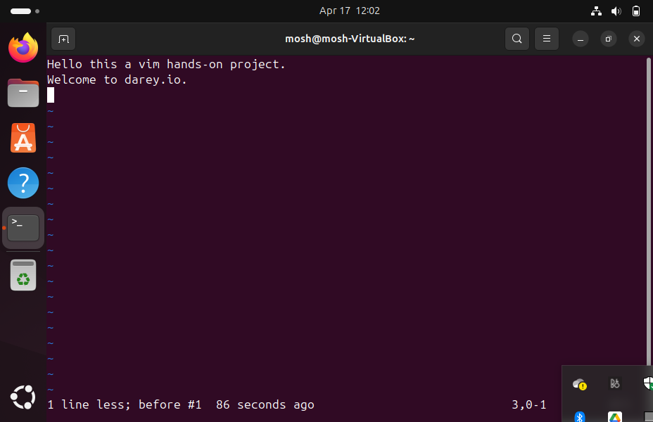

- 6. Saving Changes: Typed :wq and pressed Enter to write,save and quit the file.
    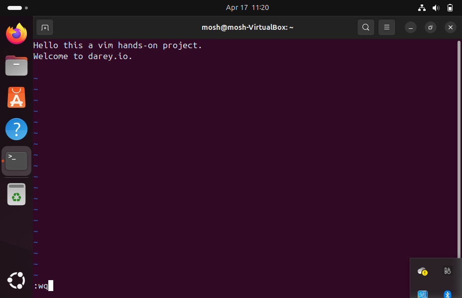

- 7 Quitting Without Saving: Pressed :q! to quit the editor without saving any changes
    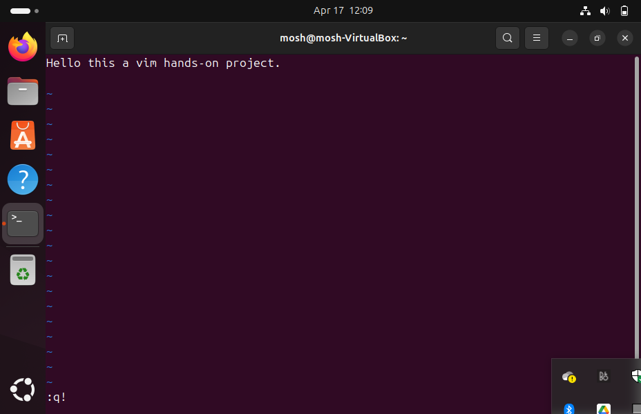

## Nano Text Editor

Nano is user-friendly and straightforward tool, making it an excellent choice for users who are new to the command line or those who prefer a more intuitive editing experience. Nano serves as a versatile and light weight text editor, ideal for performing quick edits, writing scripts, or making configuration changes directly from the command line. Below are the screenshots of the demo done with the editor

- 1. Opening a file:  Typed command nano nano_file.txt to open the file
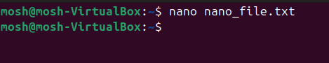

- 2. Entering and Editing Text: Typed a line of text into the file.
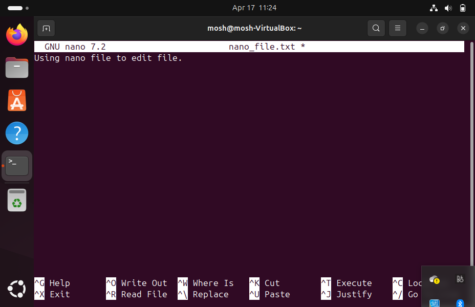

- 3. Saving Changes: Saved changes made by pressing 'ctrl + o' on the keyboard and was prompted to confirm if i wanted to save, then pressed 'Enter' to confirm.
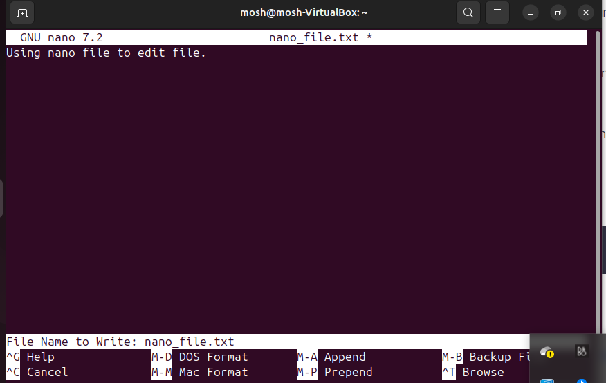

- 4. Exiting Nano: Pressed 'ctrl + x' to exit the editor.

- 5. Opening an Existing file: Used nano to open the exercise.txt file previously opened with 'vim' by typing `nano exercise.txt`
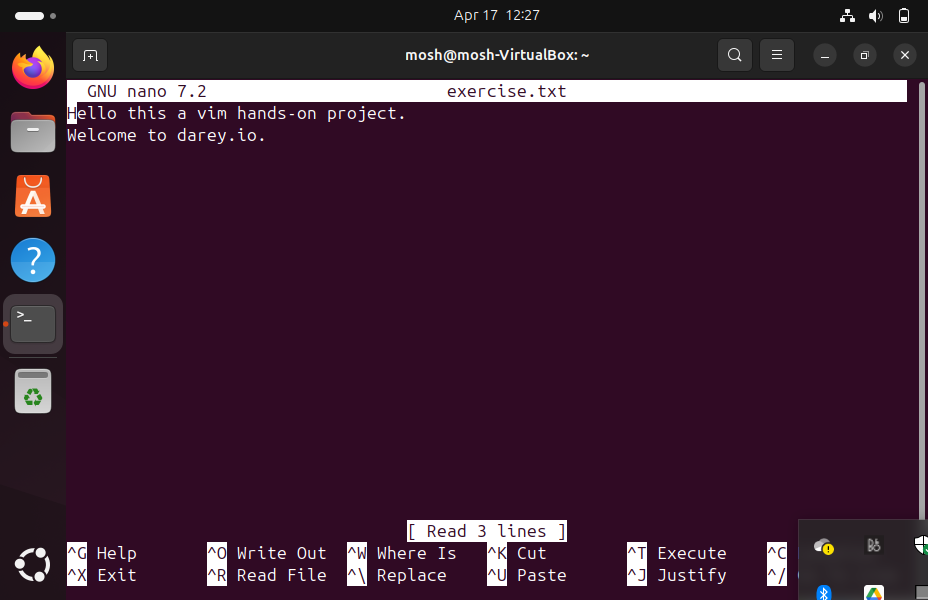
