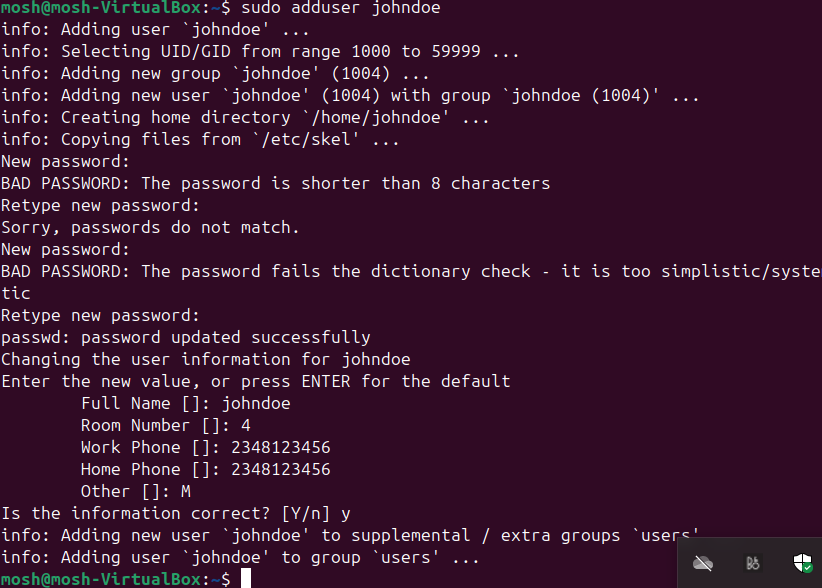

# Advance Linux Commands

## File Permissions and Access Rights

In Linux, managing file permissions and ownership is vital for controlling who can access, modify, or execute files and directories. Understanding these concepts allows one to maintain the security and integrity of the system. Below is some key commands and concept related to file permissions and ownership:

### Numeric Representation of Permissions

In Linux, permissions are represented using numeric values.

- no permission = 0
- read = 4
- write = 2
- execute = 1

These values are combined to represent the permissions for each user class. For example

#### Permission Represented by 7

- 4(read) + 2(write) + 1(execute) = 7
- Symbolic representation: rwx
- Meaning: Read, write and execute permissions are all granted to that particular user class
- Context example: Ascript file that the owner needs to read, modify and execute.

### The Role of Hyphen(-) in Permission Representation

In the context of Linux, a hyphen doesn't actually represent a user class. Instaed, it's used in the symbolic representation to show the absence of a permission.

- Pratical example

Typed command ls -latr

Command break down:

- In the output above, it can be observed that the first character can be a "-" or "d". "d" means it's a directory and "-" means it's a file.
- The next three characters(rwx) show the permissions for the owner. "r" stands for read, "w" stands for write, and "x" for execute.
- If a permission isn't granted, a "-" will be in it's place(e.g.. --x means the file only has execute permission)
- The hyphen separates owner, group and others.
- The following three characters after the owner's permissions represent the group's permissions and the last three represents permission for others. They all use the same r,w,x notation just like the owner.

### File Permission Commands

To manage file permissions and ownership, Linux provides several commands:

- 1. chmod command
The command allows modification to file permissions.
Demo example:
  - a. Created an empty file using the `touch` command
    
    - b.  Checked the permission of the file - ls -latr script.sh
    

    - c.  Updated and checked the permission to allow all the classes to have execution permission `chmod +x script.sh`
    

    - d. Used numbers approach to give read, write and execute permissions to note.txt file `chmod 777 note.txt`
    

        The dash(-) in the first position represents the file type and not a user class. It indicates that the entry is a regular file.

- 2. chown command
    The command allows one to change the ownership of files, directories, or symbolic links to a specific username or group

    Basic format:
    `chown [option] owner[:group] file(s)`

    For demo purpose, the chown command was used to grant ownership to a user(nad) and a group(developer).
    

- 3. Superuser Privilledges
    It is often necessary to become the superuser to perform important tasks in linux. In most linux distributions, there is a command that can give temporary access to the superuser's privileges. This program is called sudo and can be used in a scenario where superuser is needed for a small number of tasks.
    To switch to the root user, `sudo -i` was ran.
    

    To exit `exit` was ran.
    

- 4. User Management on Linux
    To be a great DevOps engineer, one has to know how to manage different users in a give system.
    Below are some of the task performed:
        - a.Creating a User: To create a new user on Ubuntu Server, the command 'adduser' can be used.
        e.g., create a user named johndoe `sudo adduser johndoe`
        
        Running the command will prompt you to enter and confirm a password for the new user and also some additional information about the user, such as their full name and contact information.

        - b. Granting Administrative Privileges
        By default, the newly created user account do not have administrative privileges. To grant adminitrative access to the user, it was added to the sudo group. Users in sudo group can run commands with administrative privileges.
        

        usermod: This a command that modifies user account properties
        -aG: These are flags used with the usermod command. -a stands for append and it's used to add the user to the specified group without removing them from other groups they may belong to.
        -G stands for "supplementary groups" and is followed by a comma-separated list of groups. It specifies the groups which the user should be added.

        In the command above "-aG sudo" was used to add the user "johndoe" to the sudo group

### Task 1

1. Logging in as johndoe: Signed out of from the current user and signed in back using johndoe's credentials.

2. Navigate to /home/johndoe directory.

### Switching User Accounts

To start using the system as another user, `su` command has to be run to switch.
e.g. `su mosh`

You will be prompted to enter the password for the user and once authenticated, you will switch to the user's environment.

### Modifying User Accounts

1. Changing User Password
To change the password for user johndoe, "passwd" command followed by the username "johndoe" was ran.

I was prompted to enter and confirm the new password for the user.

2. Creating a Group
To create a new group, i used the "groupadd" command as shown below

3. Adding Users to the Group
"Usermod" command was used to add users to the group "developer"

The '-aG' options appends the developer group to the users' existing group memberships.

4. Verifying Group Memberships
To confirm the group memberships for a specifi user, "id user_name" should be run. For example, the command was ran for user johndoe.

5. Deleting a User
"sudo userdel username" is to be ran to delete a user from the system. For example, the command was used to delete user "johndoe"

6. Ensuring Proper Group Permissions
Groups in Linux are often used to manage permissions for files and directories. To ensure that the relevant files or directories have the appropriate group ownership and permissions, the command "sudo chown :groupname /path/to/directory should be run. For example, the command was ran to grant the ownership of Documents directory to the group developers.

And to grant read and write permissions to the group: "sudo chmod g+rw /path/to/directory is to be ran.
[chmod-grp](screenshots/20-chmod-grw.png)

### Side Hustle Task 3

1. Crete a group on the server and name it 'devops'

2. Create 5 users'["mary", "mohammed", "ravi", "tunji", "sofia"]', and ensure each user belong the devops group

3. create a folder for each user in the "/home" directory.
a. mary home directory and group ownership

b. mohammed home directory and group ownership

c. ravi home directory and group ownership

d. tunji home directory and group ownership

e. sofia home directory and group ownership

devops group membership proof

