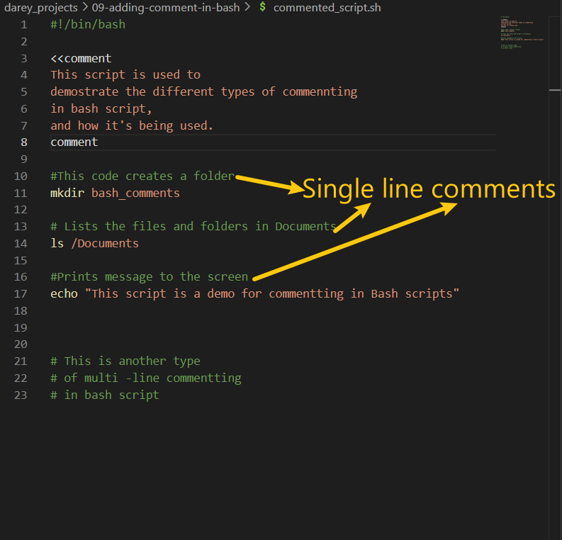
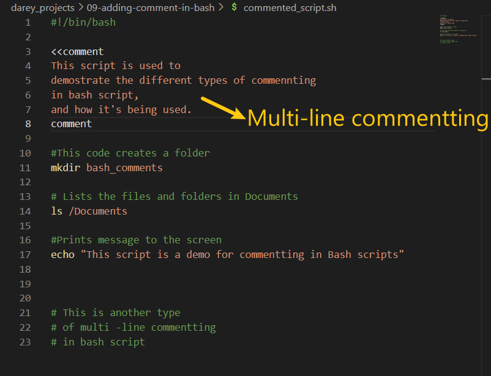
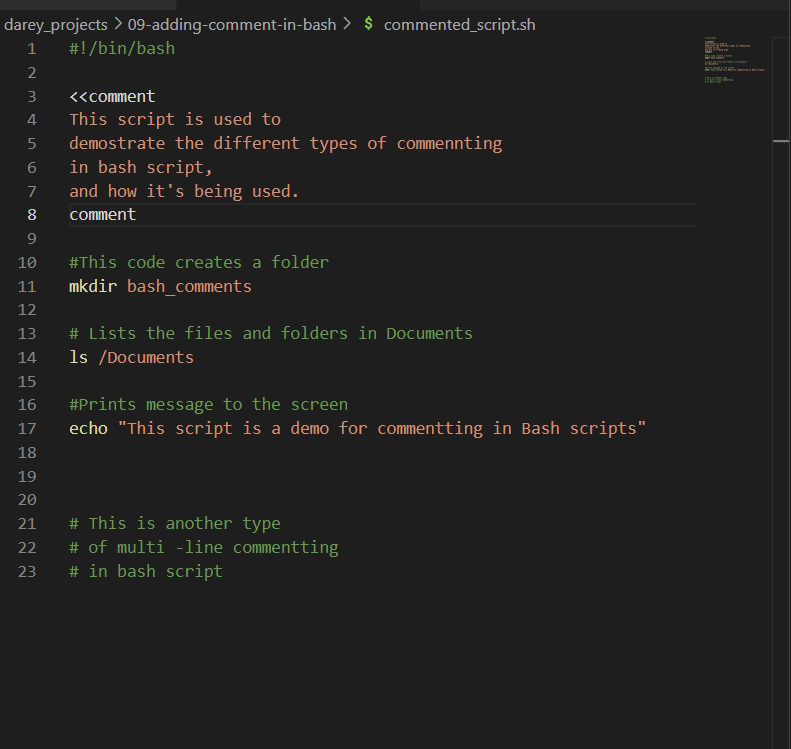

# Comments In Bash Scripts

Comments are essential in programming, serving as notes to the programmer and anyone else who might read the code.

They explain what the script or parts of the script do, making the code easier to understand and maintain.
Comments are lines in codes that are ignored by the interpreter. In Bash scripts, comments help document the purpose and logic of your understand the script's functionality.

Creation of File to be used for demo

### Types Of Comments

- 1. Single-Line Comments: In Bash scripting, single-line comments start with the # symbol. Anything written after the # on the same line is ignored by the interpreter.

Single-line comments are useful for
    - Code explanation: Adding context to complex code sections.
    - Debugging: Temporarily diisabling lines of code
    - Documentation: Providing information about script functionality.

link to use case making use of single line comments to explain code.

- 2.Multi-line Comments: Bash doesn't have a specific syntax for multi-line comments like some other languages. However, you can use:

  - 1: Using # for each line

        `# This is a multi-line comment`
        `# spanning multiple lines`
        `# using the # symbol"`
  - 2: Method 2: Using a Here Document

        `<<comment`
        `This is a multi-line comment`
        `spanning multiple lines`
        `using a Here Document`
        `comment`
        

### Best Practices For Commenting

- Clarity: Writing clear and concise comments that explain the "Why" behind the code, not just the "what".
- Maintainability: Keeping comments updated as the codes is being modified to ensure they remain relevant and helpful.
- Usefulness: Commenting on complex or non-pbvious parts of the script to provide insights into the thought process and decision making.
- Avoid Overcommenting: Commenting on every line of code is bad, especially if the code is self explanatory. The focus should be on parts that will benefit from additional explanation.

