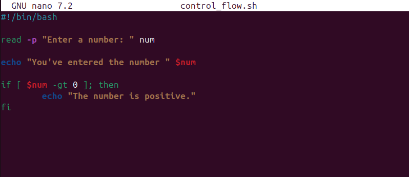

# Control Flow In Shell Scripting

Control flow statements are the backbone of making decisions in programming. It directs the order in which commands or instructions are executed in a script. In scripting, these statements let the scripts decide what to do or how to proceed on conditions, loops, or user inputs.

Bash and other shell interpreters provides control flow statements like:

- if-else
- for loop
- while loops and
- case statements to control the flow of execution in the scripts.

Demo on the most commonly used control flows (if-else and for) are show below:

- 1. if-else
The if-else control statement was used in a script that ask for a number and then tells the user if the number inputed is positive, negative, or Zero.
A. creation of a file named control_flow.sh and populating it with `read -p "Enter a number: " num`

#### Script breakdown

- #!/bin/bash: This tells the system to run the script with Bash interpreter.
- read -p "Enter a number: ": This command ask the user to input a number. The -p flag allows us to display a prompt message on the screen when the script gets executed.

The script was executed and it asked me to input a number. Nothing was displyed after entering the number.

The script was updated to print out the number inputed.

B. "If" control block statement was added to the script to check if the number entered is positive.

The "-gt" in the condition is called operator and is used within the condition block to perform numeric comparisons between values.

Output of the code when executed:

C. "elif" and "else" control block was added to demostrate how it works with the if control statement. The elif statement gets executed if the code in the if block isn't satisfied while the else block gets executed when the conditions in if and elif isn't satisfied.

Below is the output of the execcuted script with elif and else

D. Loop: Loops are fundamental constructs that allow for repetition of set of commands multiple times. It make automation and repeat of tasks without writing the same code over and over again possible.
There three primary types of loops in Bash scripting. They are commonly used to repeat a set of commands multiple times based on certain conditions. The loops are:

- For
- While
- Until

Demo was done for one the loop types is shown below:

- For Loop
The for loop is used to iterate over a list of values or a range of numbers. It is particularly useful when one know in advance how many times the loop body needs to be executed.
The for loop has two main forms:
- List Form: Iterate over a list of items

In the demo script above:
- The loop starts with for i in 1 2 3 4 5, meaning the variable i will take each value in the list(1,2,3,4,5) in turn.
- For each value of i, the loop executes the commands between do and done.
- The command echo "Hello, World! This is message $i" prints a greeting along with the current value of i. once i has taken each value in the list, the loop ends.

Here is another style of writing a for loop:

Correct permission was set for the script and below is the output of the execution

C-style Form: This style allows for specification of an initializer, condition, and increment/decrement expression. It is based on the same syntax used in doing a for loop in C programming. Below is the demo script:
[c-style-for-loop](screenshots/11-c-style-loop.png)

Output after execution

Breakdown of the syntax used in the script:

- "for (( ... ));": This is the syntax that starts a C-style for loop in Bash. It's distinguished from the list form by the double parentheses "(( ... ))", which enclose the three parts of the loop: "initialization, condition, and increment/decrement".

- "i=0": This is the initialization part. Before the loop starts, "i" is set to "0". This typically sets up a counter variable to start from a certain value. In this case, i starts from 0.

- "i<5": This is the condition for the loop to continue running. After each iteration of the loop, Bash checks this condition. If it's true, the loop continues; if it's false, the loop ends. Here, the loop will continue as long as **i** is less than "5".

- "i++": This is the increment expression. It's executed at the end of each loop iteration. i++ is shorthand for incrementing i by 1 (i = i + 1). This step ensures that the loop will eventually end by changing the value of i so that the condition i<5 will not always be true.

- "do ... done": Encloses the commands to be executed in each iteration of the loop. Here, the command inside the loop is **echo "Number $i"**, which prints the current value of "i" to the console.

How the C-style for loop works:

- Initialization: Before the first iteration, "i" is set to "0".
- Condition Check: Before each iteration, including the first, Bash checks if i is less than 5.
  - If the condition is true, Bash executes the commands inside the loop.
  - If the condition is false, Bash exits the loop.

- Execute Commands: The command(s) inside the "do ... done" block are executed. In this case, it prints the current value of "i".
- "Increment:" After executing the commands, "i" is incremented by "1" using the syntax "(i++)".
- **Repeat:** Steps 2 through 4 are repeated until the condition in step 2 is false.

**Lets take a Walkthrough to further expand on your understanding**

- "First Iteration:" i=0, condition 0<5 is true, prints "Number 0", increments i to 1.
- "Second Iteration:" i=1, condition 1<5 is true, prints "Number 1", increments i to 2.
- "Continues iteration" ...
- "Fifth Iteration:" i=4, condition 4<5 is true, prints "Number 4", increments i to 5.
- "Sixth Check:" i=5, condition 5<5 is false, loop ends.
