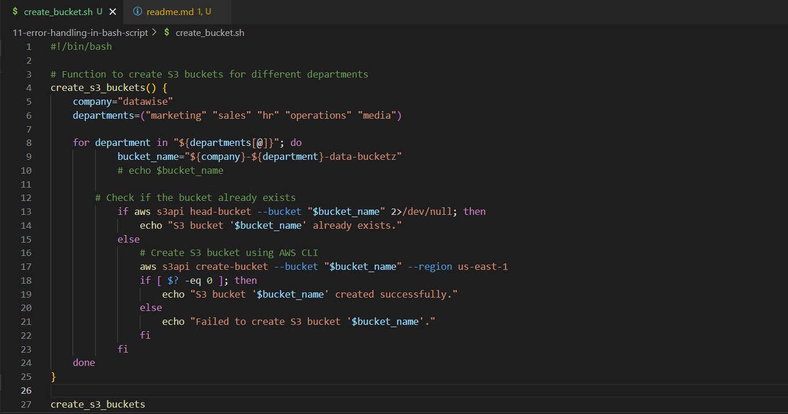
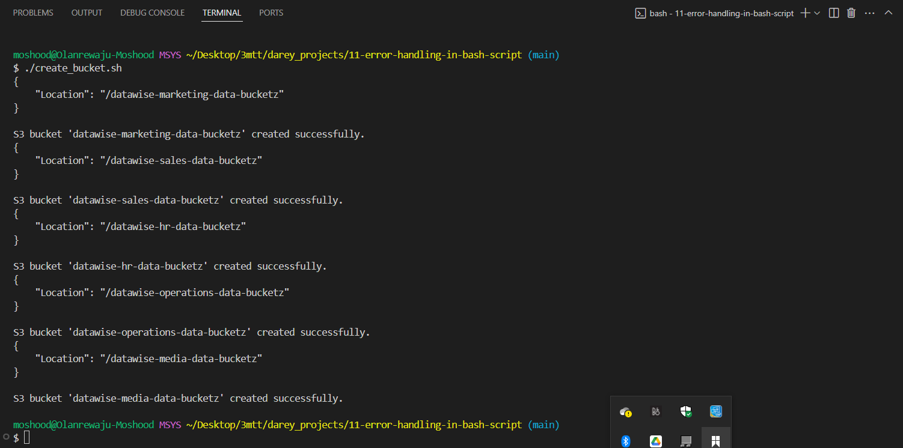
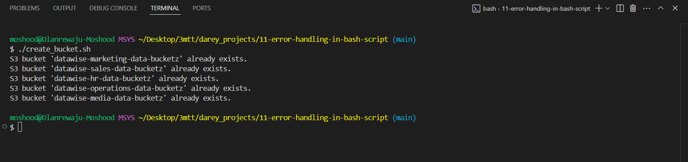
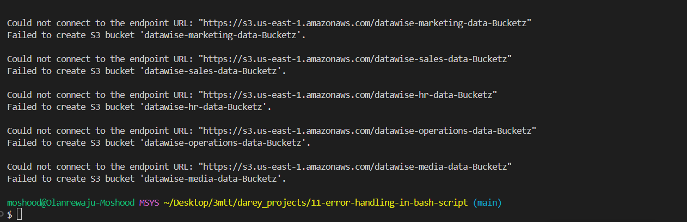

# Error Handling in Shell Scripting

Error handling is a crucial aspect of scripting that involves anticipating and managing errors that may occur during script execution. These errors could arise from various factors such as incorrect user input, unexpected system behavior, or resource unavailability. Proper error handling is essential for improving the reliability, robustness, and usability of shell scripts.

### Implementing Error Handling

When implementing error handling in shell scripting, it's essential to consider various scenarios and develop strategies to handle them effectively. Below are some key steps to follow when implementing:

- Identify Potential Errors: Start by identifying all possible sources of errors in the script, such as user input validation, command execution, or file operations. Anticipate scenarios where errors may occur and how they could impact script execution.

- Use Conditional Statements: Utilize conditional statements(if, elif, else) to check for error conditions and respond accordingly. Evaluate the exit status ($?) of commands to determine whether they executed successfully or encountered an error.

- Provide Informative Messages: Provide descriptive error messages that clearly indicate what went wrong and how users can resolve the issue.

### S3 Bucket Creation

The "create_bucket.sh" script seeks to create a  S3 bucket on AWS. Below are lessons learnt with the script code and execution:

- The script followed the best practice by identifying the pontential errors ahead and how to effectively manage it.

- The script made use of conditional statements(if & else) to check for error conditions and responded appropiately.

- Descriptive messages were used to describe the errors.

Below are the various output gotten when testing out the script:

- Create Bucket Script

- Bucket successfull creation

- Bucket name already exist

- Other error

