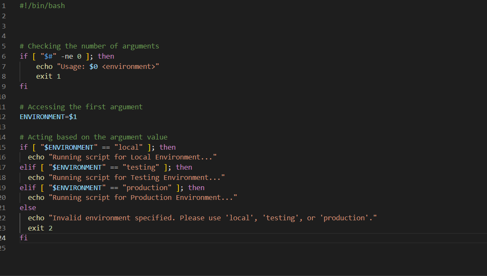
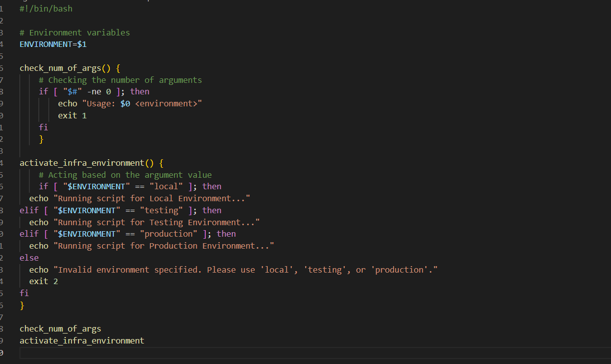
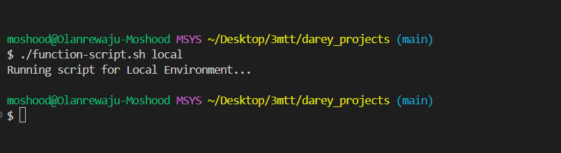
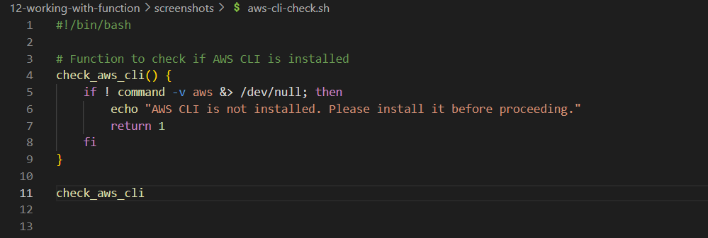
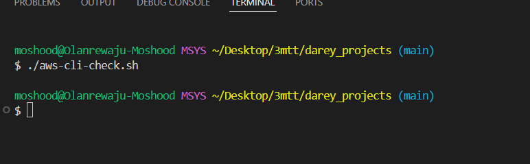
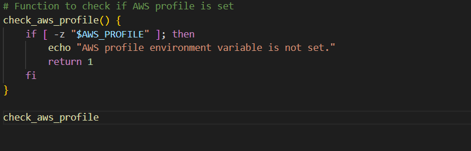
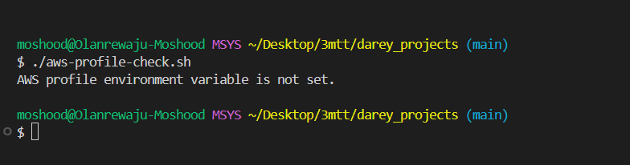
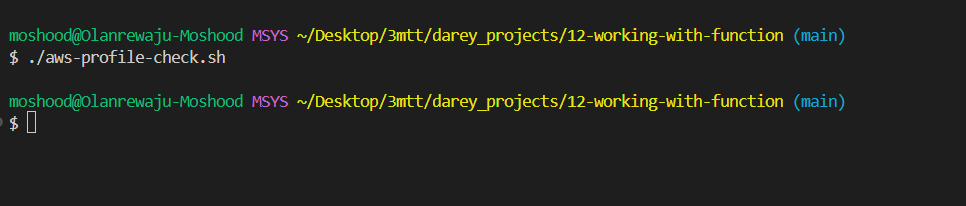
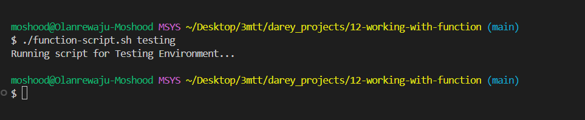

# Working with Funtions

The project seek to demostrate how to use function organize codes for better clarity and efficiency.
By encapsulating specific logic within functions, the script can be streamlined and improve readability.

This project seek to demostrate the usage of function in code by implementing the following:

- Check if script has an argument
- Check if AWS CLI is installed
- Check if environment variable exists to authenticate to AWS

To cretae a function in a shell script, it is defined using the syntax below:

` function_name() { `
   ` # Function body `
   ` # You can place any commands or logic here `
   `}`

Breakdown of the syntax is as follows:

- function_name: This is the name of the function. It's adivsed to choose a descriptive name that reflects the purpose of the function.

- (): Parentheses are used to define the function. They can be omitted in simpler cases, but it's good practice to include them for clarity.

- {}: Curly braces enclose the body of the function, where you define the commands or logic that the function will execute.

### Check if script has an argument

In this section, a block of code was refactored with functions to check argument and environment was implemented.
Below is the code without a function:

After implementing functions, the code now looks like this:

The script was executed to test the functions implemented

- Check argument function
![check-args]
(screenshots/check-args-output.png)

- Activate Infrastructure Environment

It's crucial to consider the order in which the interpreter evaluates each line of code. Placing the function where it logically fits within the flow of the script ensures that it is available and ready to be executed when needed. The organization helps maintain the readability and coherence of the script, making it easier to understand and debug.

### Check if AWS CLI is installed

To check if AWS CLI is installed the below code was implemented

Script commands breakdown:

- if !command -v aws &> /dev/null; then:

  - !: This is the logical negation operator. It reverses the result of  a command, so !command means "if not".
  - command -v aws: This command checks if the aws command is availaible in the system. It returns the path to the aws executable if it exists, or nothing if it doesn't. It returns the same output from the "which" command.
  - &>/dev/null: This part redirects both standard output(stdout) and standard error(stderr) to /dev/null, a special device file that discards all output. This effectively suppresses any output from the command -v command.
  - then: This keyword indicates the begining of the code block to execute if the condition in the if statement is true.
  - echo "AWS CLI is not installed. Please install it before proceeding.": This line prints an error message to the standard output if the AWS CLI is not installed.
  - return 1: This line causes the function to exit with a non-zero exit status(1). A non-zero exit status conventionally indicates an error condition in Unix-like systems.

Output when the script was executed

This returned no output because the condition in if block wasn't met, which means there is a AWS CLI present on the system.

### Check if environment variable exists to authenticate to AWS

To programmatically create resources in AWS, there is need to configure authentication using various means such as environment variables, configuration files, or IAM roles.
To setup authentication through environment variable this code will be executed `export AWS_PROFILE=<desired_profile_name>`.

- AWS Profile : This environment variable allows users to specify which profile to use from the AWS config and credentials files.
Below is the code to check if the profile has been set:

Output when the script was executed

This shows that the environment variable hasn't been set.

And when the environment varibale was set  with `export AWS_PROFILE="darey_demo", below was the ouptput
.

Combining all the functions together into a single script(./function-script.sh) gives the output below:

