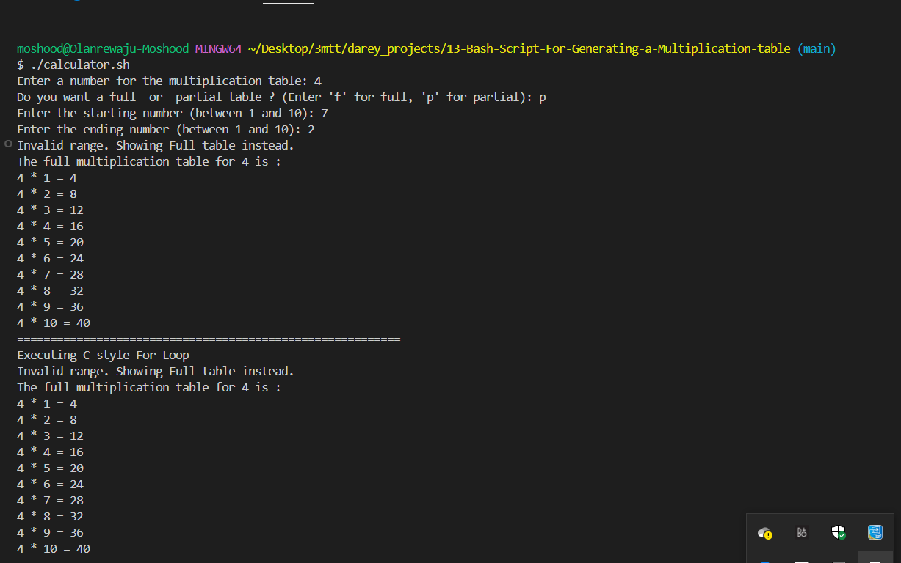

# Generating a Multiplication Table

This project seeks to cretate a Bash script that generates a multiplication table for a number entered by the user.

### Project Description

The script prompts the user to enter a number and then ask if they prefer to see a full multiplication table from 1 to 10 or partial table within a specified range. Based on the user's choice, the script will display the corresponding multiplication table.

Script Flow:

1. Prompt the user to enter a number for the multiplication table.

2. Ask if the user want a full table or partial table.
    - if partial, prompt for the start and end numbers of the range.

3. Validate the range inputs and handle invalid or out-of-bound entries.

4. Generate and display the multiplication table according to the specified range.

Below are the screenshots of the demo.

1. Full Multiplication Table

2. Partial Multiplication Table

3. Invalid range for Partial table

4. Out of bound range for Partial table

The c style for loop is based on arithmetic conditions and increment and can be used for more complex arithmetic operation than the normal for loop.

The full script for the Multiplication table generation is named calculator.sh(In the same directory as this readme file.).
