# Security And Identity Management(IAM)

This mini project is a guide through the intricacies of Amazon Web Services(AWS), specifically focussing on Identity and Access Management(IAM).
This project worked with a hypothetical fintech startup named Zappy e-Bank. The company was used to represent a typical startup venturing into the financial technology sector, aiming to leverage the cloud's power to innovate, sclae, and deliver financial services. The scenario is set up to provide a realistic backdrop that will help to understand the application of AWS IAM in managing cloud resources securely and efficiently.

### Importance of IAM for Zappy e-Bank

ForZappy e-Bank, like any company dealing with financial services, security and compliance are paramount. The company must ensure that its data, including sensitive customer information is securely managed and that access to resources is tightly controlled. AWS IAM plays a critical role in achieving these security objectives by allowing the company to define who is authenticated(signed in) and authorized(has permissions) to use resources.

### Project Tasks

1. Setup  Policy

- Logged in to the AWS Management Console using the root user account.
- navigated to IAM console and created two policies for development  and analyst team.
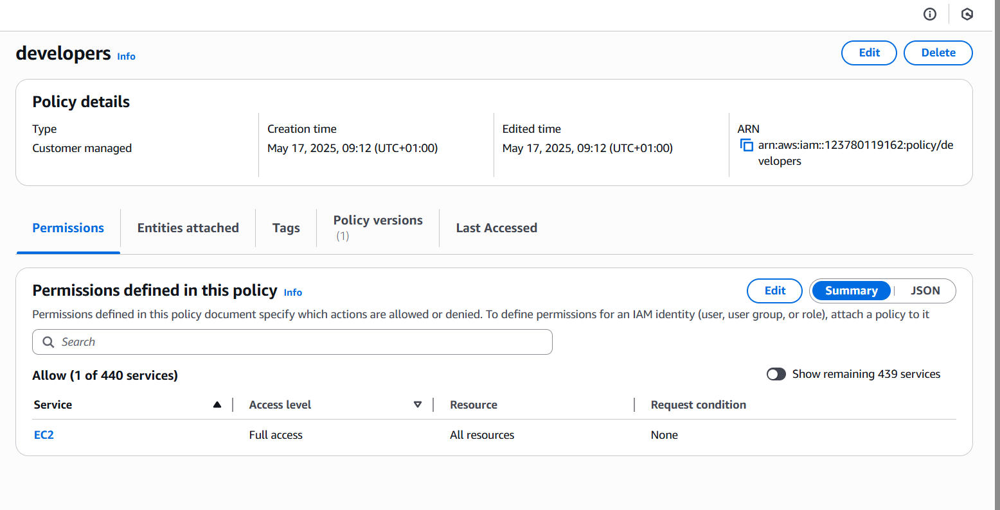

    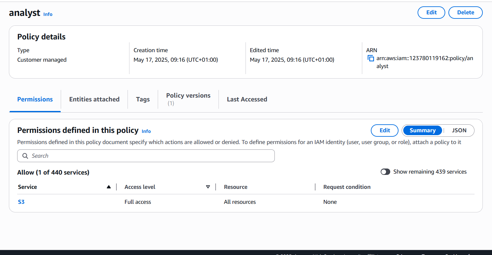

2. Created groups for both development and analyst teams and attached respective policies to the groups.
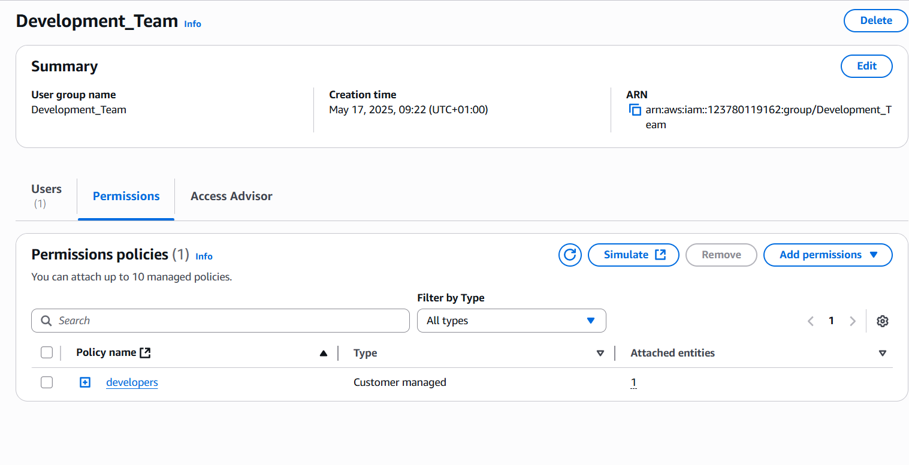

    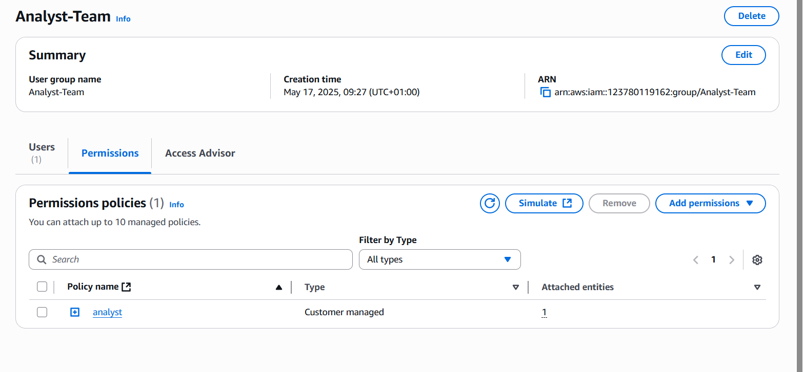

3. Created IAM users

- John: Backend developer was added to the development group in order to have access to development team's permissions.
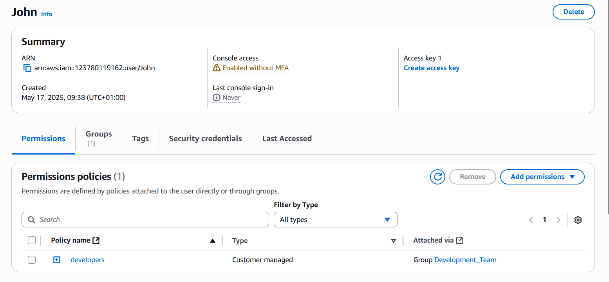

- Mary: Data analyst was added to the analyst group in order to have access to data storage(AWS S3 service).
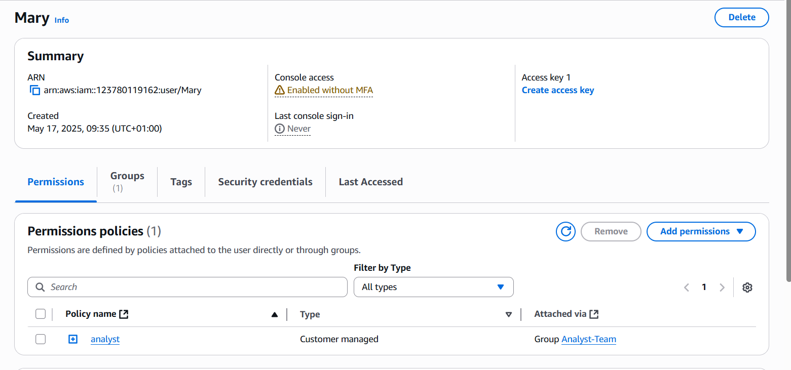

### Testing and Validation

1. Testing John's Access
Logged in using user John credentials to check/test user permissions:

- Access to EC2 Dashboard: John was able to view, launch and manage EC2 instances due to his role which requires access to servers for deploying and managing backend applications.
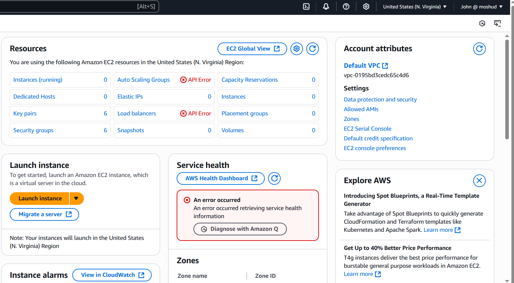

- Perform EC2 Actions: Created a new EC2 instace that confirms that John has the necessary permissions.

    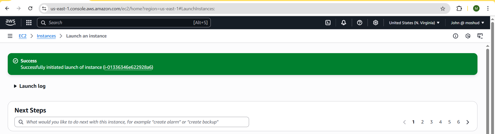

    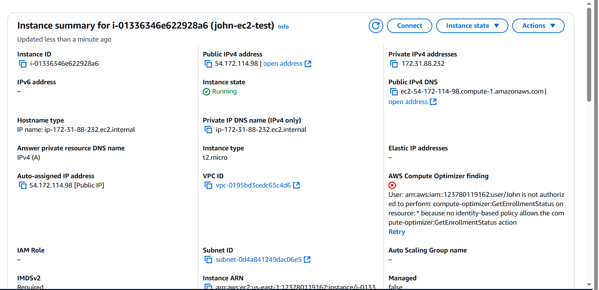

2. Testing Mary's Access
Used Mary login credentials to log into the AWS Management Console. This ensures that Mary's user experience is as expected and that she has the correct access.

Access S3 Dashboard: Mary was able to view, create and manage S3 buckts as her role requires access to data storage for analyzing and managing data.
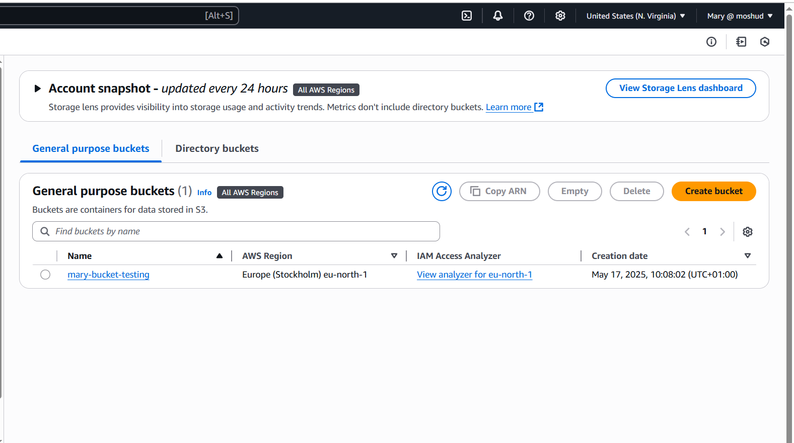

Perform S3 actions: Mary was able to create, upload, and delete a S3 bucket and object.

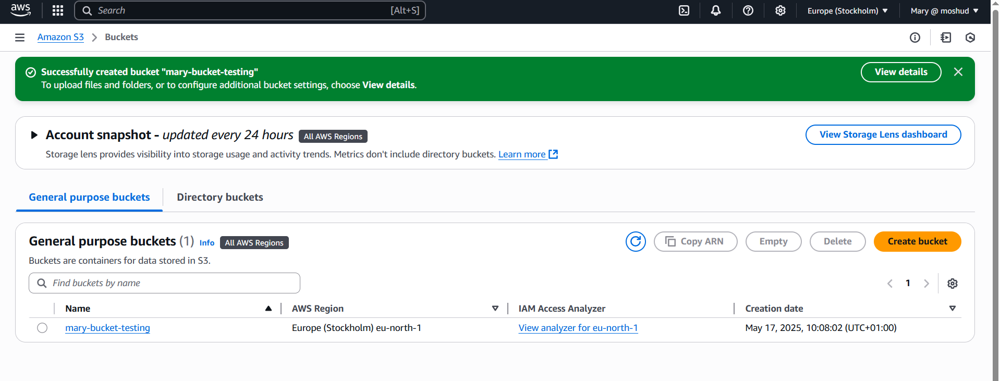

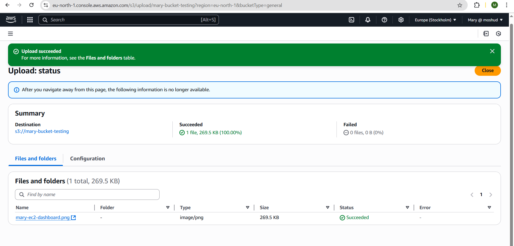

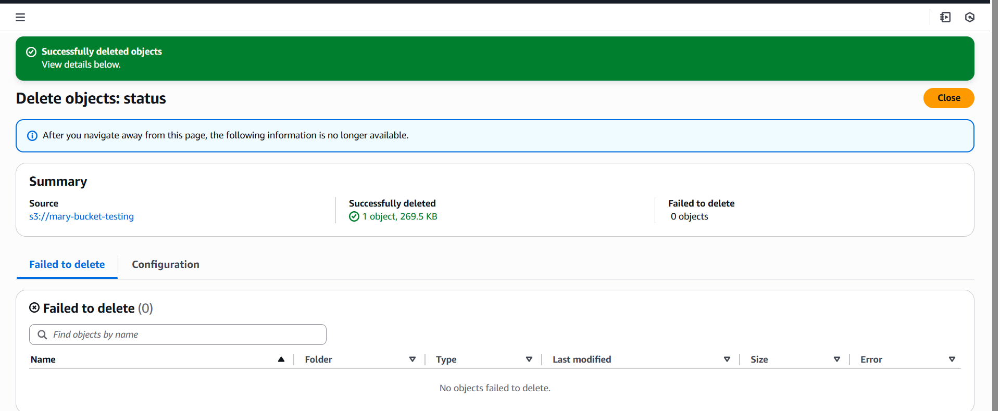

3. Validate Group Policies
Access to other resources apart from the one associated to the groups the two users belong to was tested.

- John's access to S3

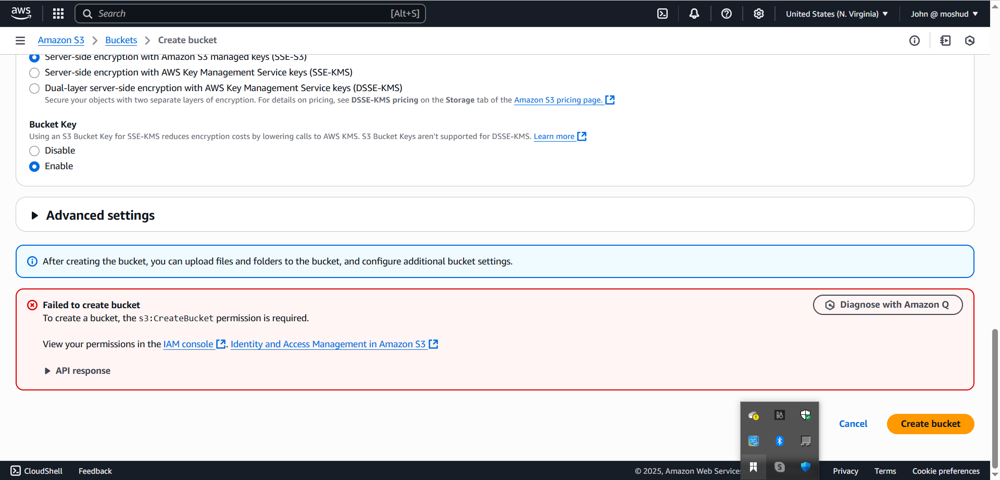

- Mary's acess to EC2

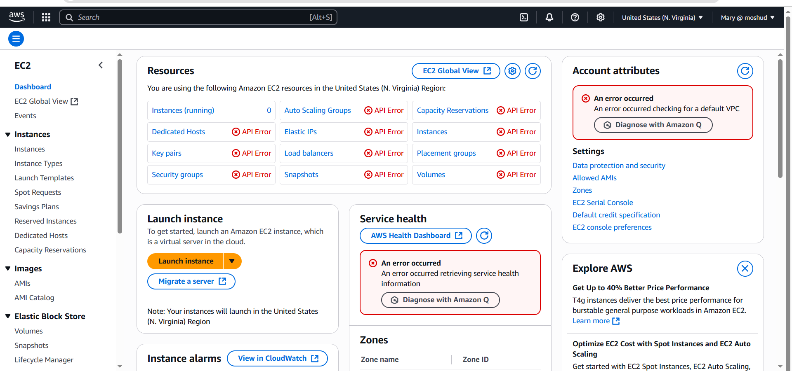

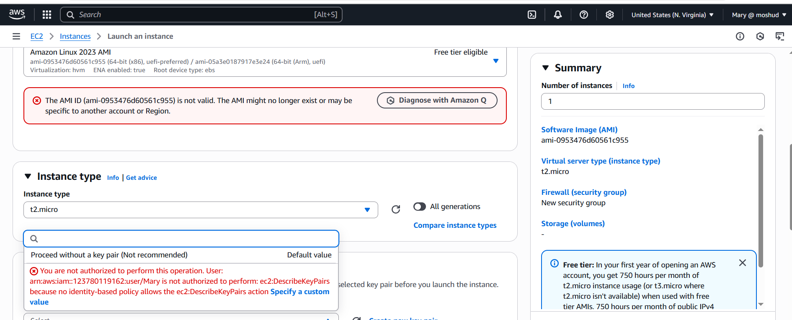

### Multifactor (MFA) Setup

Multifactor authentication isa security feature that adds an extra layer of protection to the aws account and resources. With MFA enabled, users are required to provide two or more forms of authentication before accessing AWS resources.

The following steps was followed to setup MFA for both users:

- Clicked on the user option on the IAM page and the chose a each user simultaneuosly (John/Mary)
- Clicked on enable MFA on the users page

- Entered a device name for each user and selected authenticator app and clicked next.

- Opened Google authenticator app on my mobile device and scanned the QR code for each user respectively and filled in the 2 consecutive codes.

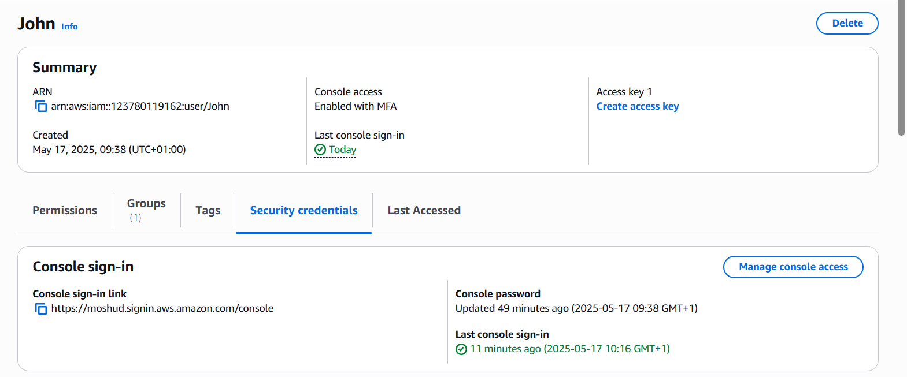

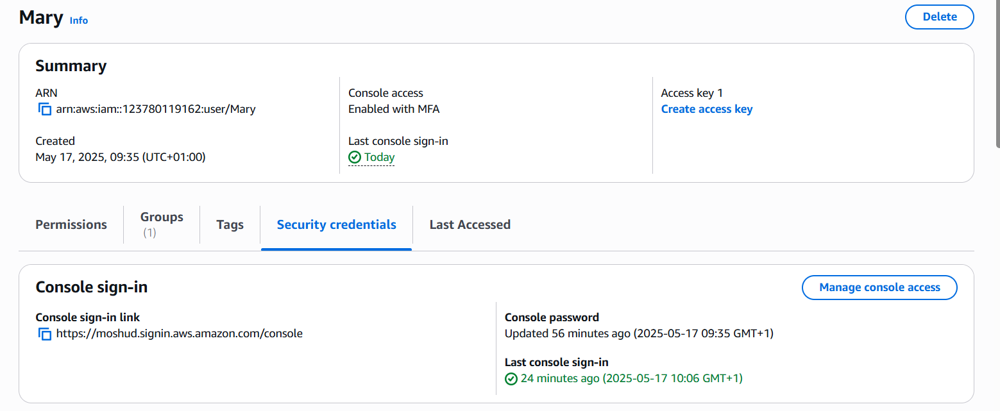

### Project reflection

1. Role of IAM in AWS: IAM (Identity and Access Management) in Amazon Web Services (AWS) is a critical service that helps manage access control and authentication within the AWS cloud environment. Its primary role is to ensure secure and controlled access to AWS resources, making it foundational for cloud security and operational efficiency.

Purpose of IAM in AWS

- User Authentication and Authorization
IAM enables the creation of individual users, groups, and roles, and allows you to assign permissions to them. This ensures that only authenticated and authorized entities (people, applications, or services) can access specific AWS resources.

- Fine-Grained Access Control
IAM lets you define granular permissions using IAM policies, written in JSON. This allows you to precisely control who can do what, such as allowing a developer to read from an S3 bucket but preventing them from deleting objects.

- Centralized Access Management
IAM provides a single point to manage access to all AWS services and resources. This centralized approach simplifies administration and helps maintain consistent security practices across your cloud infrastructure.

- Support for Temporary Access
IAM allows you to create temporary security credentials using IAM roles. This is especially useful for applications, EC2 instances, or federated users (e.g., single sign-on with corporate credentials) to access AWS resources without storing long-term credentials.

- Multi-Factor Authentication (MFA)
IAM supports MFA for an added layer of security. Even if a password is compromised, unauthorized access is prevented without the second authentication factor.

- Auditing and Compliance
IAM works with AWS CloudTrail to log all access and API activity. This helps in monitoring usage, performing security audits, and ensuring compliance with industry standards.

How IAM Enhances Security and Efficiency

Minimizes Attack Surface: By applying the principle of least privilege, IAM ensures users and services only have the permissions they need, reducing the risk of accidental or malicious misuse.

Improves Operational Control: IAM roles and policies can be automated and managed programmatically, enabling efficient provisioning and de-provisioning of access.

Enables Secure Automation: IAM facilitates secure communication between services (e.g., Lambda accessing DynamoDB) without embedding credentials in code.

Scales with Organizations: IAM supports integration with organizational identity providers, allowing centralized management of large user bases via federation.

2. Difference between IAM USers and Groups:

| Feature            | **IAM User**                                                   | **IAM Group**                                                   |
| ------------------ | -------------------------------------------------------------- | --------------------------------------------------------------- |
| **Definition**     | An individual identity with specific credentials.              | A collection of IAM users managed as a unit.                    |
| **Purpose**        | Used to represent a single person or application.              | Used to simplify management of permissions for users.           |
| **Permissions**    | Assigned directly to the user or inherited from groups.        | Assigned to the group, inherited by all users in the group.     |
| **Authentication** | Has unique login credentials (username/password, access keys). | Groups do not have credentials—they exist only to manage users. |
| **Use Case**       | Used when individual access and credentials are needed.        | Used when multiple users need the same set of permissions.      |
| **Best Practice**  | Assign permissions via groups instead of directly to users.    | Manage policies centrally and apply them to many users.         |

3. Process of Creating IAM Policies for Developers team.

-  Navigate to the IAM console and click on policies

- Click on create policy

- In the select a service section, search for ec2

- For practice sake, select "All EC2 actions" checkbox

- Also select "All" in the Resources section

- Click Next

- Provide a name for the policy and description(optional).

- Click on Create Policy

4. Significance of the Principle of Least Privilege:
The Principle of Least Privilege (PoLP) means giving users, applications, or services only the permissions they need to perform their tasks—no more, no less. In the context of AWS IAM, this is a fundamental security best practice.

Why It’s Important for AWS Cloud Security

✅ 1. Minimizes Risk of Unauthorized Access
By limiting permissions, you reduce the chances of a user or service accidentally or maliciously accessing sensitive data or performing destructive operations.

Example: A user who only needs to read objects in an S3 bucket shouldn't have the ability to delete them.

✅ 2. Prevents Accidental Misuse
Users often make mistakes. With least privilege, even if a user misuses a resource, the damage is limited because they don’t have broader access.

Example: A developer accidentally deploying a change to production can be prevented if their IAM role only has access to staging.

✅ 3. Reduces Impact of Compromised Credentials
If an attacker gains access to a set of credentials with limited permissions, the scope of the breach is minimized.

Example: If access keys from an IAM user get leaked, but that user can only write to a specific S3 folder, broader AWS resources remain secure.

✅ 4. Improves Compliance and Auditing
Regulatory frameworks (like HIPAA, PCI-DSS, and ISO 27001) often require strong access controls. Enforcing least privilege helps meet these compliance requirements and makes auditing easier.

How AWS IAM Helps Implement Least Privilege

- IAM Policies: Define fine-grained permissions at the action and resource level.

- IAM Roles: Provide temporary, scoped permissions to services and users.

- Permissions Boundaries: Restrict maximum permissions an IAM entity can have.

- Access Analyzer: Identifies unused or overly broad permissions.

- CloudTrail + IAM Access Advisor: Audit and analyze permission usage.

5. Reflecting on the project scenario with John and Mary, the project applied the principle of least previlege by creating specific policy for the roles each user belongs to which ensures that their permissions are limited to only what was needed. 
 
