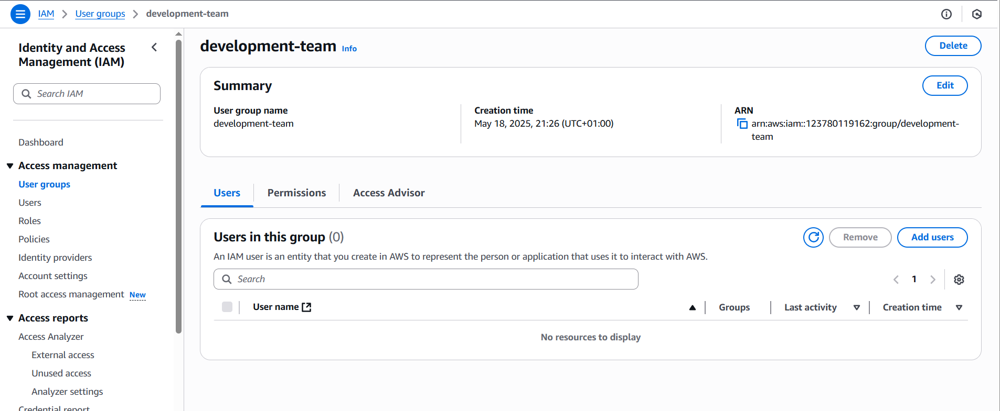
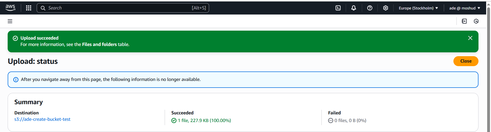

# AWS Identity and Access Management

This project aim to introduce AWS Identity and Management(IAM), which helps control who can access what in Amazon Web Services.

## Project Goals

- Understanding AWS Identity and Management(IAM) principles and components.

- Learning to create and manage IAM policies for regulating access to AWS resources securely.

- Application of IAM concepts practically to controll access within AWS.

- Explore best practices for IAM implementation and security in AWS.

## Definitions

- Identity and Access Management(IAM): It's the system that manages and organizes user identities and access permissions across an organization's resources, ensuring that the right users have access to the right resources at the right time. It helps organization improve security, streamline processes, and enable better business outcomes.

- IAM User : IAM user are like individual accounts for different people or entities withing the AWS environment.

- IAM Role: The role defines what someone or something(application/service) can do within the AWS account. Each role has a set of permissions that determine which actions can be performed and which AWS resources can be accessed. IAM roles are flexible and can be assumed by users, services, or applications as needed. They are commonly used for tasks such as granting permissions to AWS services, allowing cross-account access, or providing temporary access to external users. It enhances security and efficiency by providing controlled access to AWS resources without the need for permanent credentials.

- IAM Policy: It's a set of rules that define what actions a role can take. These rules specify the permission granted to the role and users. They are essential for maintaining security and controlling access to AWS resources, ensuring that only authorized actions are performed by users and roles within the AWS account.

- IAM Group: It's like a collection of IAM users. Instead of managing permissions for each user individually, they(users) can all be organized into groups based on their roles or responsibilities.

## Best Practices

## Demo

A growth marketing consultancy company called GatoGrowFast.com wants to give some access to their employee Eric, Jack, and Ade to AWS resources.

The demo was done in two parts. The first part involves creation of a policy granting full access to EC2, then a user naned Eric was created with the policy created before attached to it.
The second part demonstraes how to create a group,policy and adding of users to the group with the policy attached.

### Part 1

1. Create Eric Policy

2. Create User Eric and attach Eric Policy

### Part 2

1. Create "development-team" user group

2. Create users Jack & Ade and associate them with "development-team" user group

3. Create "development-policy" with full EC2 and S3 permissions.

4. Attach "development-policy" to "development-team" user group.

### Permission Validation

1. Eric's  EC2 access validation

- EC2 Launch

- EC2 Termination

2. Eric's access to S3 validation

3. Eric's access to IAM console

4. Jack access to Ec2 validation

- EC2 Launch

- EC2 Termination

5. Jack's access to S3 validation

- Create bucket

- Upload object

- Delete object

6. Jack's access to IAM console

7. Ade S3 access validation

- Bucket creation

- Object Upload

- Object delete

8. Ade's EC2 access validation

- EC2 Launch

- EC2 Terminate

9. Ade's IAM console access validation

## Project Reflection

- IAM serves as the security foundation for AWS resources, controlling access and permissions.

- IAM ensures dat protection, compliance, and prevents unathorized access.

- Learnt how to create and apply  policy to regulate resource access effectively.
