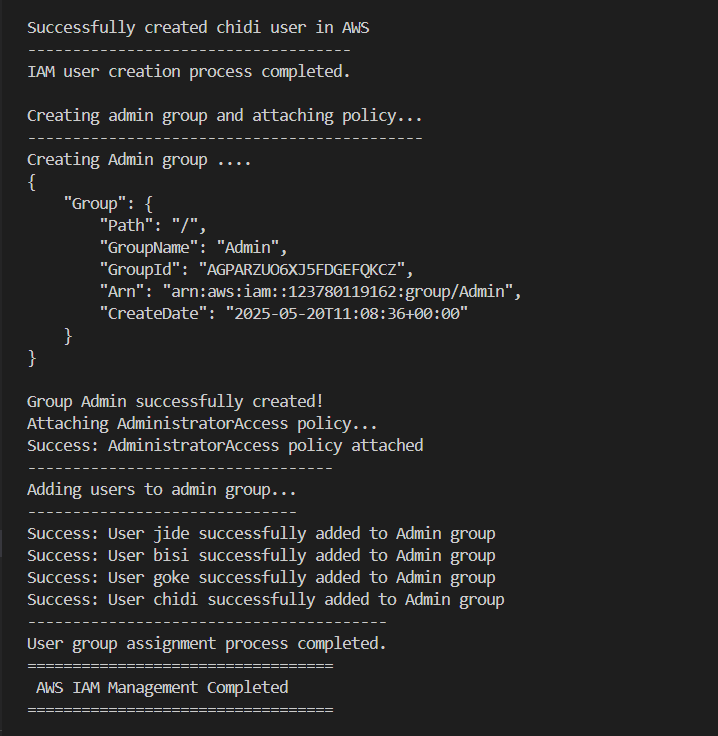

# Shell Script For AWS IAM Management

## Project Scenario

CloudOps Solutions is a growing company that recently adopted AWS to manage its cloud infrastructure. AS the company scales, they have decided to automate the process of managing AWS Identity and Management(IAM) resources. This includes the creation of users, user groups, and assignment of permission for new hires, especially for their DevOps team.

## Objectives

Create a bash script that:

- Define IAM User name array to store the names of four IAM users in an array.

- Create the IAM users using AWS CLI commands.

- Define and call a function to create an IAM group named "Admin" using AWS CLI commands

- Attach an AWS-managed administrative policy (AdiministratorAccess) to the admin group

- Iterate through the array of IAM user names and assign each user to the "Admin" group using AWS CLI commands.

## Demo

1. Bash Script code: Below is the code used in achieving the objectives above:

2. Output of the execution

3. Output when there is existing user(s)/group(s):

4. Proof of resource creation on AWS console

- Users

- Admin Group

- Admin group members

- Admin group Policy

