# AWS S3 Mini Project

## Project Goals

The primary goal of this project is to get familiar with Amazon S3(Simple Storage Service) and  its fundamental concepts.

## Project Outcomes

By the end of the project, the demo will have shown the practical experience in working with S3.
The following will be demonstrated:

- Creation and configuration of S3 buckets using the AWS Management Console.

- Uploading of files and management of objects within S3 buckets.

- Understand the importance of versioning and its implication for data management.

- Configuration of permissions to control access to S3 objects.

- Implemwntation of lifecycle policies to automate data management tasks and optimize storage costs.

## Demostration

1. Creation of S3 bucket using AWS console

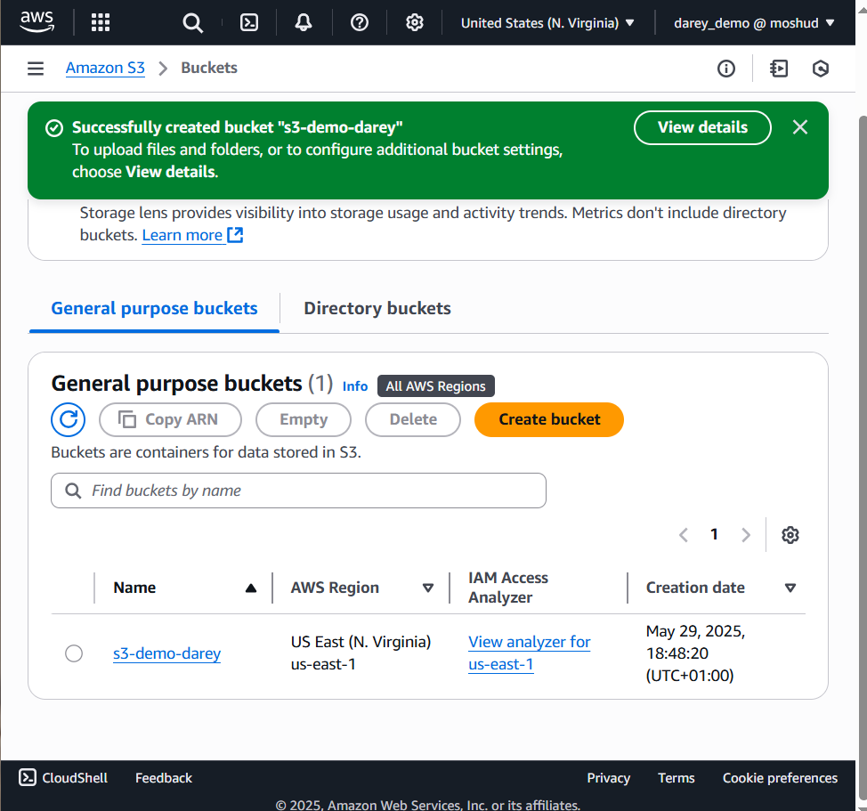

2. Uploading file to S3 bucket

Content of the local file uploaded

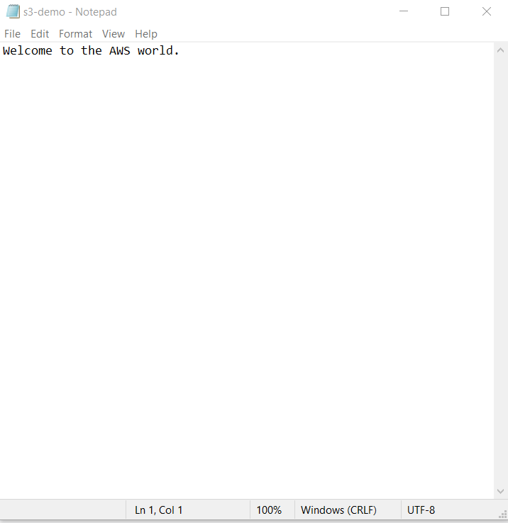

File uploaded successfully

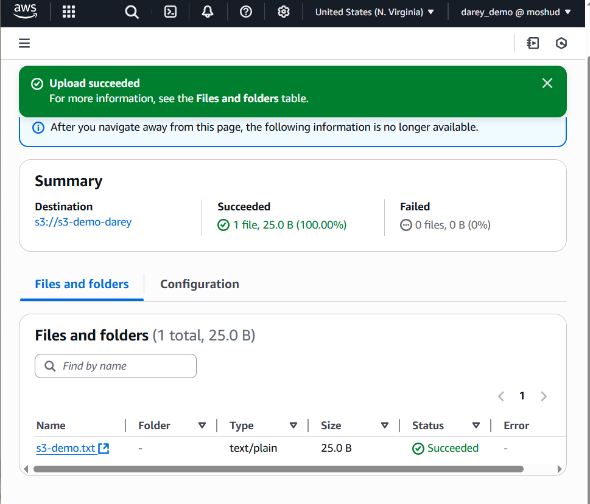

3. Object versioning: S3 versioning allows keeping of multiple versions of an object in the same bucket. This feature helps protect against accidental deletion or overwrite. The prevous version(s) of an object can be restored if needed.

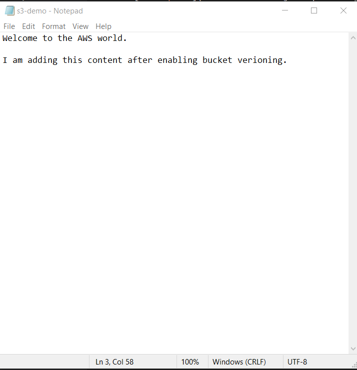

Current state of object versioning(disabled)

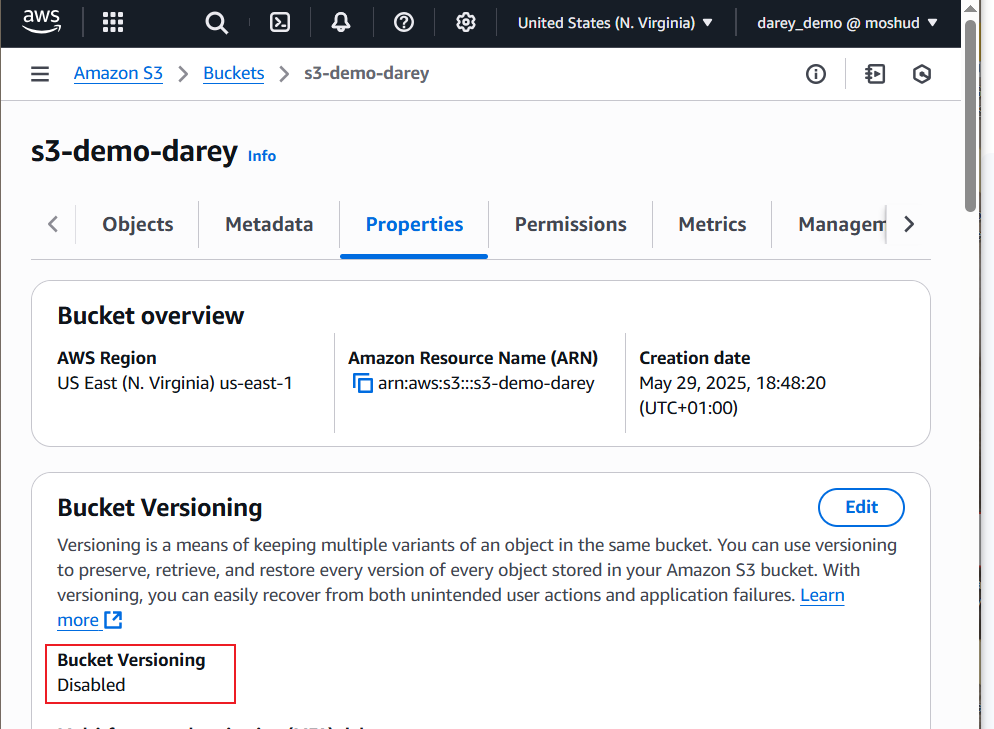

Enable object versioning

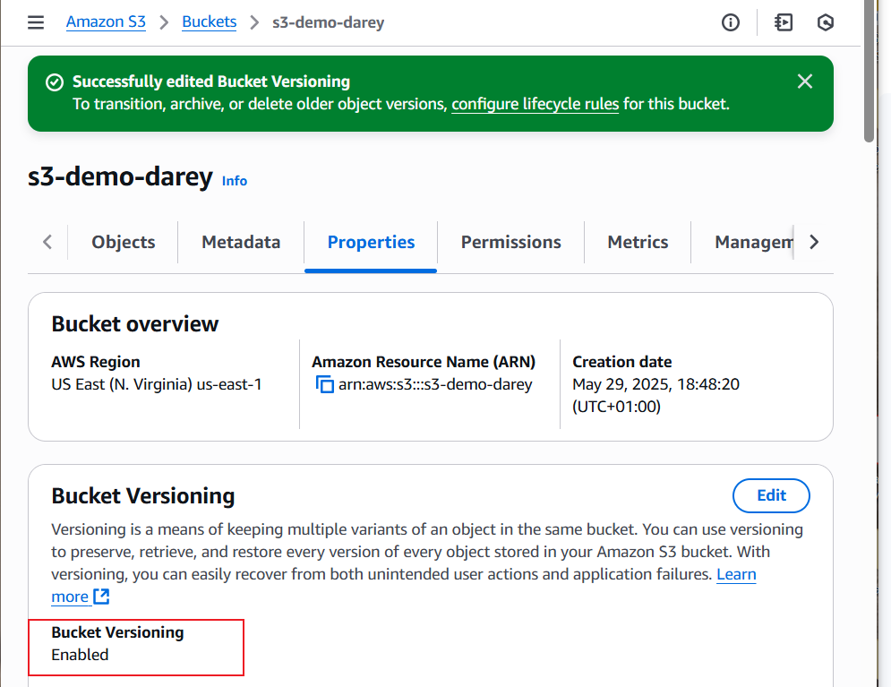

S3 Object version

[object-versioning](screenshots/s3-demo-version.png)

4. Permission configuration: Access to the objects in the S3 bucket was configured using Access Control Lists(ACLss) and Bucket Policy. Control can also be achieved using Identity and Access Management(IAM) at user or group level.

ACL configuration

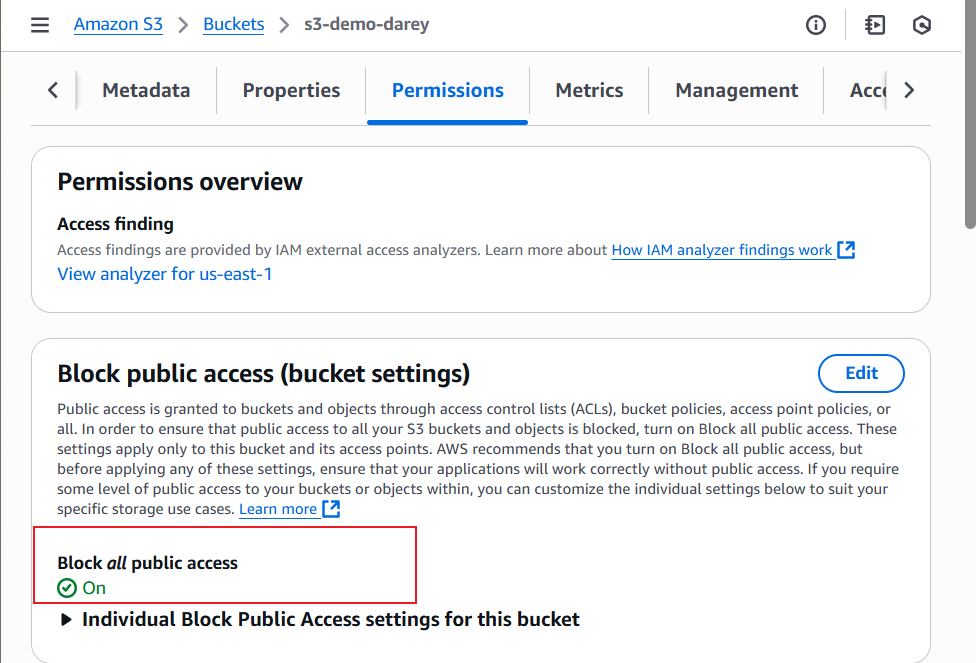

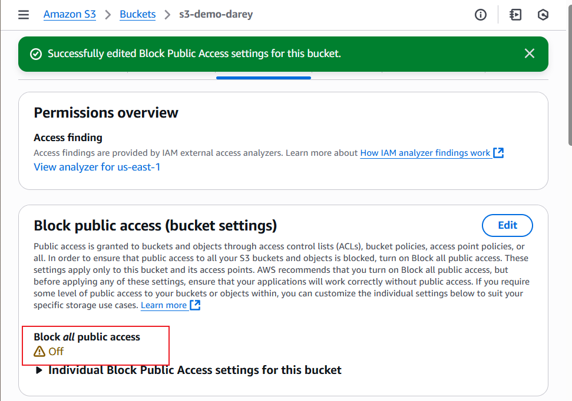

Policy configuration

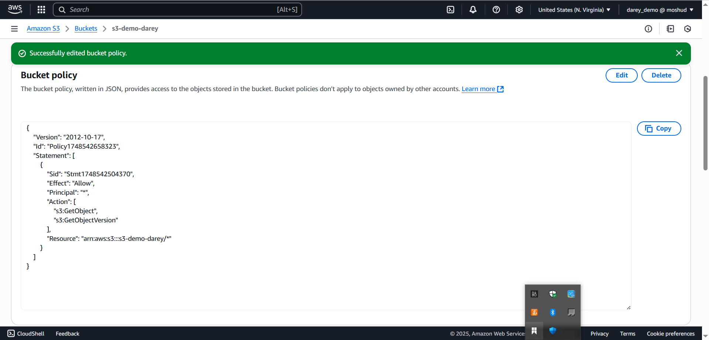

Accessing Object version 1 from the public url

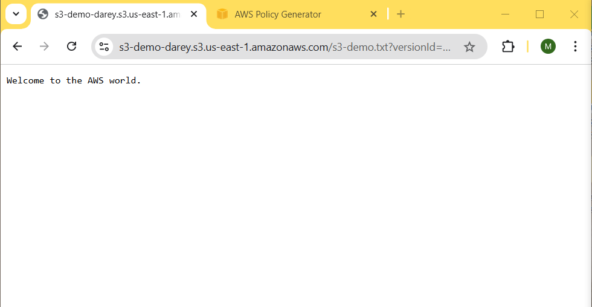

Acessing Object version 2 through public url

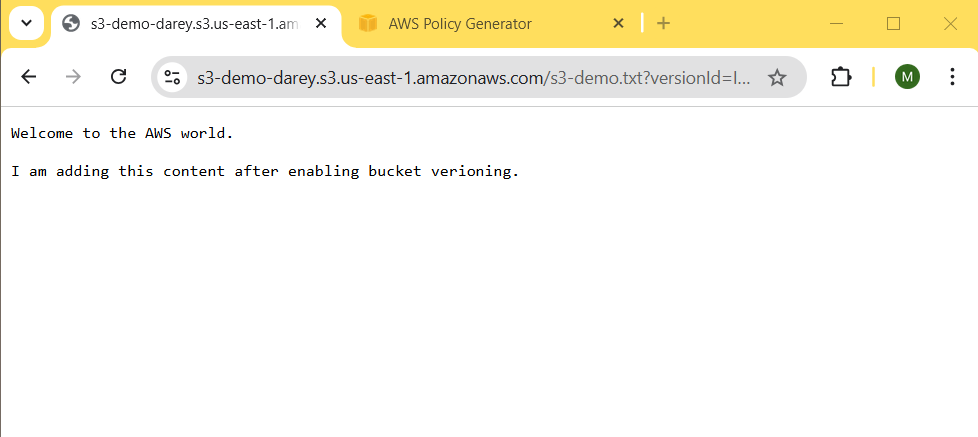

5. Bucket Lifecycle: A lifecycle rule was created to transition the objects between storage classes after 30 days of its creation.

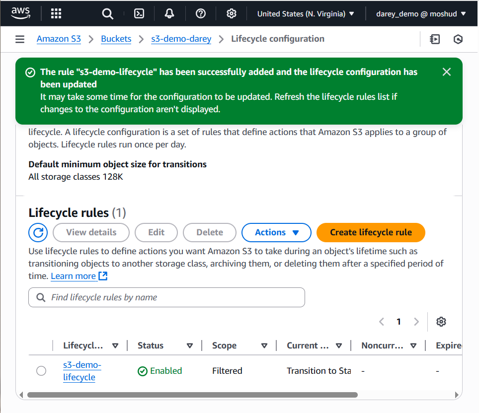

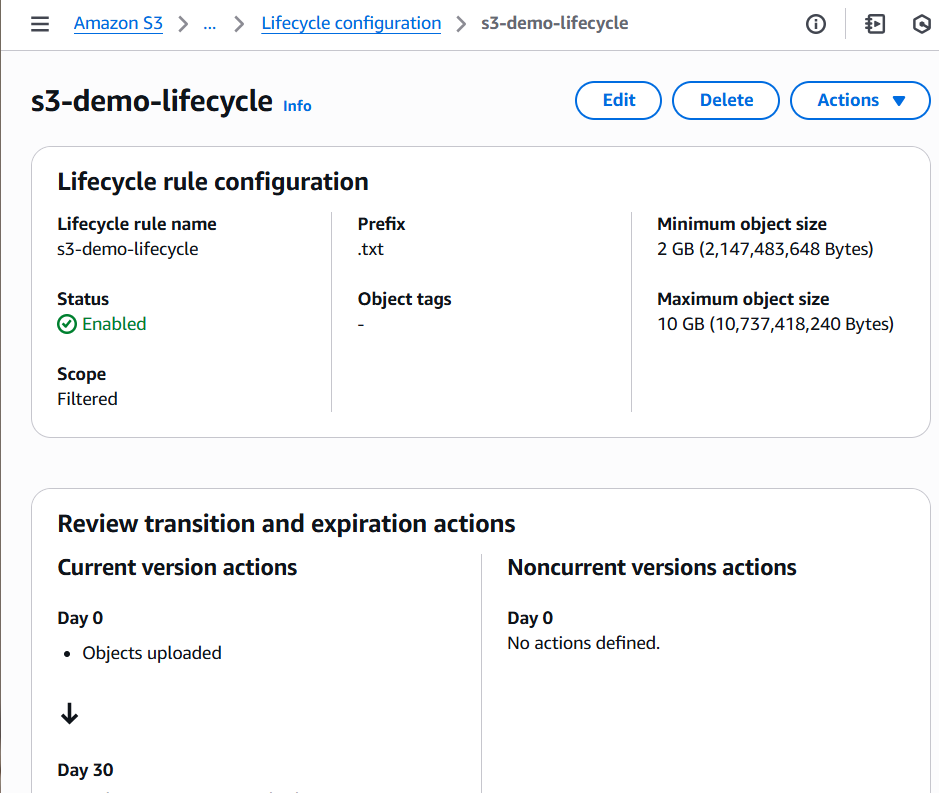

This rule will automatically move files from standard to Standard-IA storage class after 30 days.This helps to save money because Standard-IA is cheaper that the default storage option.
