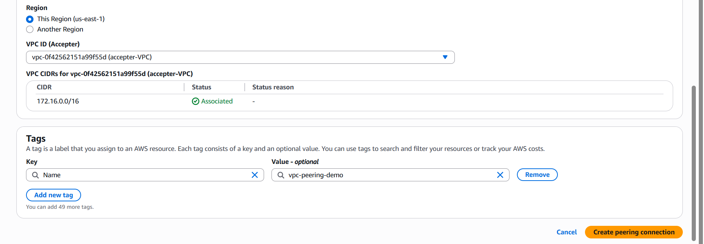

# AWS Private Virtual Cloud(VPC)

A Private Virtual cloud(VPC) is a fundamental service that allows for provisioning a logicacally isolated section of the AWS Cloud where AWS resources can be launched. It can be visualized as a private, customizable data center network within the AWS public cloud.

## DEMO

1. Setting up a virtual Private Cloud(VPC)
    a. Search for "VPC" on the AWS console search bar.

    b. Click on the create VPC button

    c. Select the "VPC only" option and specify the IPV4 block

    d. Click "Create VPC" button

2. Configuring Subnets within VPC
    a. Navigate to the "Subnets" option located on the left sidebar of the newly created VPC. Click on it.

    b. On the subnet page click on "Create subnet" button.

    c.  Select the ID of newly created VPC.

    d.  Enter new subnet name

    e. Choose the availability zone and specify the IPV4 CIDR for the subnet.

    To create another subnet, "Add subnet" button is to be clicked. Steps d-e is then repeated again. 

    f. Click "Create subnet" 

3. Creating Internet Gateway and attaching it to VPC

    a. Click on "Internet Gateway" option on the sidebar

    b. On the gateway page, click "Create Internet Gateway" button

    c. Specify the name of the Internet Gateway

    d. Click on "Create Internet Gateway" button to create the new gatway.

    e. Click on "Actions" and select "Attach to VPC" to  attach th Internet gateway to the VPC created earlier.

4. Enabling Internet Connectivity with the Internet Gateway by setting up Routing tables
    a. Click on "Route Tables" on the left sidebar

    b. Click on "Create route table" button on the route table page

    c. Next, click on "Subnet associations", followed by "Edit subnet associations" to associate the subnet with the route table. The public subnet will be associated with this table.

    d. Naviget to "Routes" and then click on "Edit routes", click on "add route" and select "Destination as "0.0.0.0/0" which indicates that every IPV4 address can access the subnet(Public subnet).
    In the "Target" field, choose "Internet Gateway" and select the Internet gateway created earlier. 

5. Enabling outbound internet access through NAT Gateway
    a. Navigate to the "NAT Gateways" seection and click "Create NAT Gateway"

    b.  Specify a desired name for NAT Gateway and choose the private subnet

    c. Select the connectivity type as private and click "Create NAT Gateway"

    d. select the NAT Gateway and navigate to the details tab. Locate the subnet ID and click on it.

    c. In the subnet page, navigate to the "Route Table" section, then click on the "route table ID"

    d. Navigate to the "Routes" section, then click "Edit routes"

    e. Click on "Add routes", select "Destination" as "0.0.0.0/0". "Target" field, choose "NAT Gatway",select the NAT gatewway created.
    Click on "Save changes"

    f. To associate the private subnet:
        i. navigate to the subnet association section, then click on edit subnet association. 

        ii. Choose the private subnet and click on "Save associations"

6. Establishing VPC Peering Connections

    a. Enter "VPC" in the console search bar to navigate to VPC section

    b. Locate the "Create VPC" button and click on it.

    c. On the create vpc page, select the "VPC only" option and specify the IPV4 CIDR block, then proceed to click the "Create VPC" button. Repeat this step agin to create another vpc in the same region.

    d. Navigate to the "Peering Connections" option on the left side bar of the VPC page on the console, upon clicking, click on the "Create Peering Connection button"

    e. On the Peering Connection page, select the VPC to be used as the requester

    f. Choose the account "My account" since the VPCs are in your AWS account.

    g. Select the accepter VPC and finally click on Create Peering Connection" button

    h. In the Peering Connection Page, click on the "Actions" tab and accept the peering request.

    i. Click on main route table ID of the accepter VPC,choose the route table, then navigate to the "Routes" section and click on "Edit route".

    j. Click on "add route" and input the requester VPC IPV4 CIDR as the destination and the newly created vpc peering connection as the target, the click save changes.

    k. Now, do step j for the requester VPC and that completes the VPC peering process.

