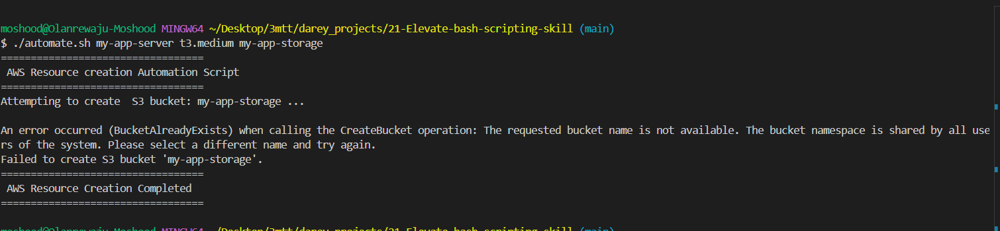

# Essential Skills to Elevate Shell Scripting

The objective this project is to advace the knowledge of  shell scripting while also integrating and utilizing cloud services.The project focussed on 5 critical concepts, functions, arrays, environment variables, command line arguments and error handling.
The aim is to elevate the knowledgeto a level where one can confidently navigate and harness the power of both shell scripting and cloud computing. For better understanding, the project simulated a real world scenario to demostrate it.

## DEMO

### Background 

Datawise Solution  is a forward-thinking Data Science Consulting Company that specializes in deploying analytical and machinelearning environment to support data-driven decision making for its clients. Recognising the need for agility and efficiency in setting up such environments, Datawise has decided to streamline its deployment process on AWS, focusing on simplicity and automation.

### Scenario

One of Datawise Solutions' clients, a burgeoning e-commerce startup is looking to harness the power of data science to analyze customer behaviour and enhance their shopping experience. The startup wishes to deploy their data science workshop on AWS utilizing EC2 instances for computational tasks and S3 buckets for storing their vast datasets of customer interactions.

### Specific Requirementts

To meet the client's needs, Datawise plans to develop a script that automates the setup of EC2 instances and S3 buckets. The script incorporate the 5 critical shell scripting concepts mentioned earlier.

Below is the screenshot of the source code used for powering the automation

1. Functions: Implemented custom functions to modularize the tasks of creating EC2 instance and S3 bucket.

EC2-running

S3 bucket create success

2. Array: Used array to manage the list of ec2 instances and s3 buckets

3. Environment Variables: Leveraged environment variables to store configuration variables

4. Command Line Arguments: Accepted command line arguments to customize script behaviour

5. Error handling: Implemented robust error handling mechanisms to catch and respond to AWS service exceptions.

