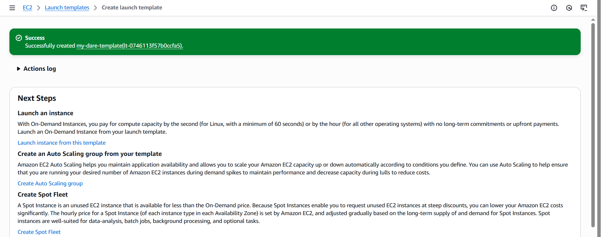
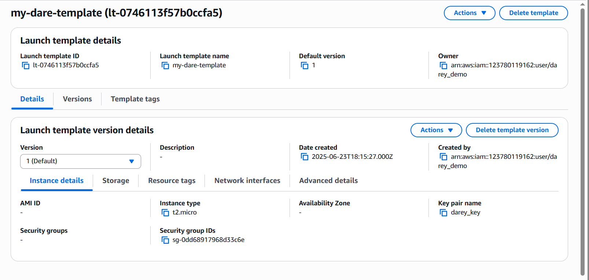
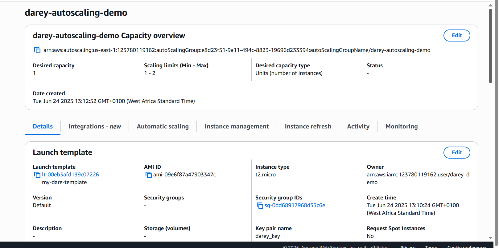
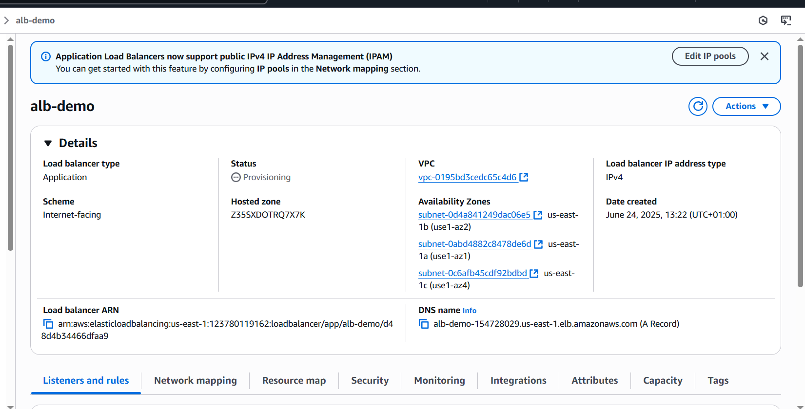
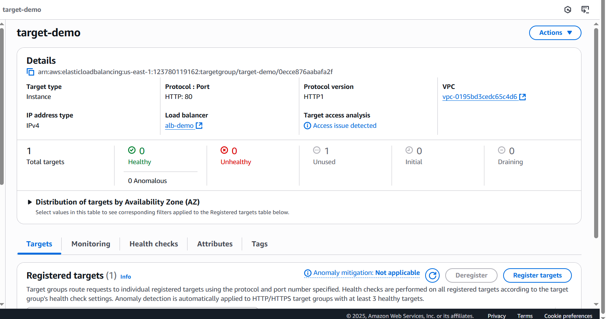
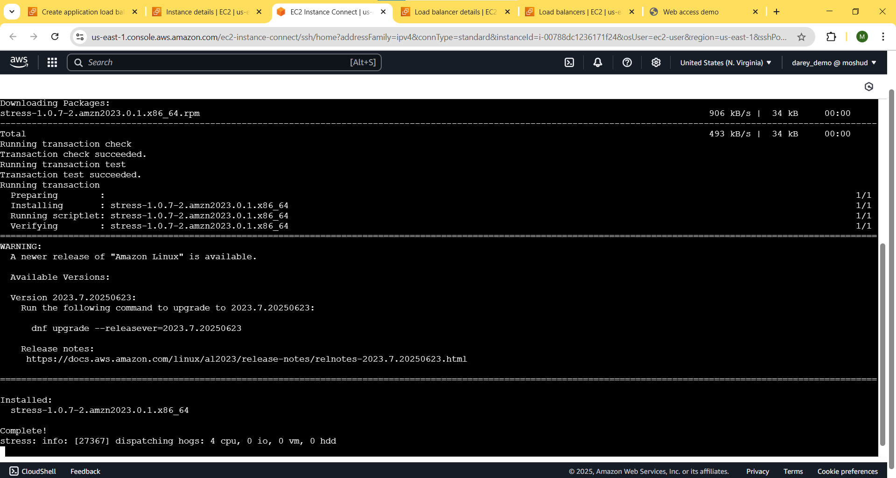
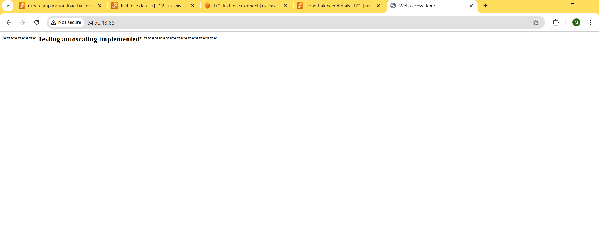

# Configuring Auto Scaling with ALB Using Launch Template

This mini project demostrates how to configure Auto Scaling in AWS with an Application Balancer(ALB) using a Launch Template. The demo shows automatic scaling of EC2 instances based on demand while leveraging the benefits of a Launch Template.

## Objectives

1. Create Launch Template

2. Setup Auto Scaling Group

3. Configure Scaling Policies

4. Attach ALB to Auto Scaling Group

5. Test Auto Scaling

## Tasks

 Task 1: Create Launch Template

Task 2: Setup Auto Scaling Group

Task 3: Attach ALB to Auto Scaling Group

Test Auto Scaling

