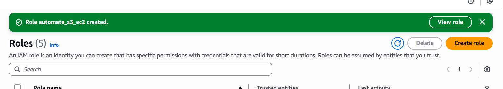
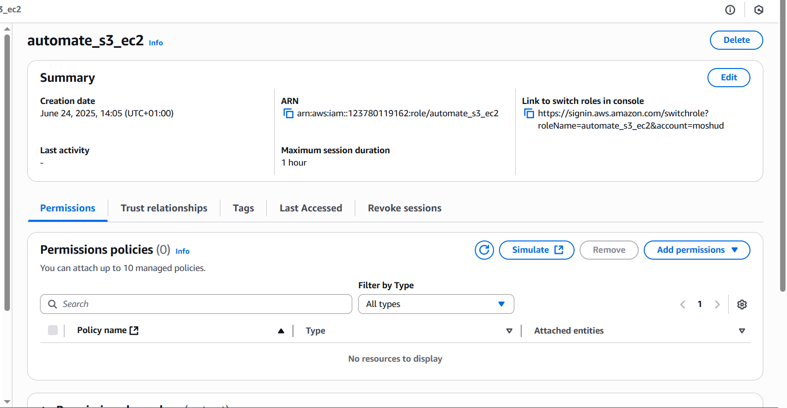
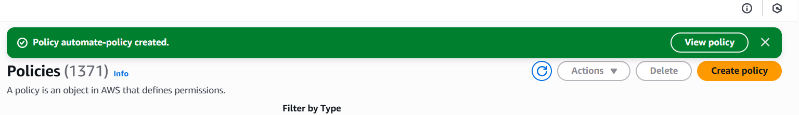
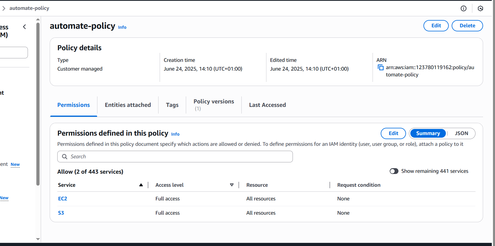
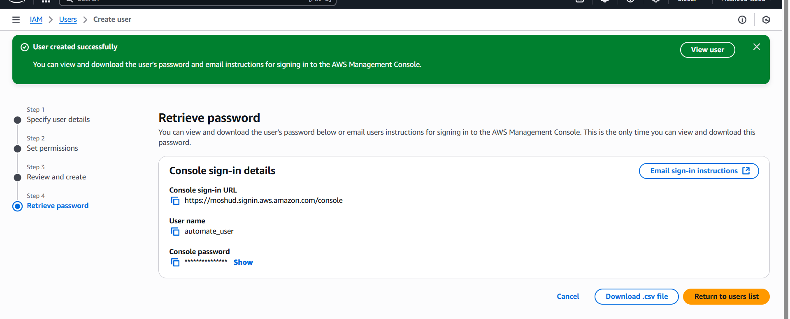
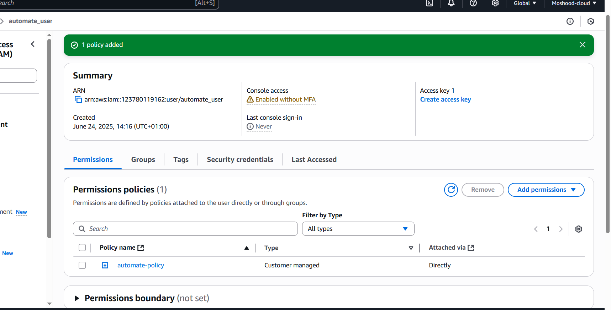
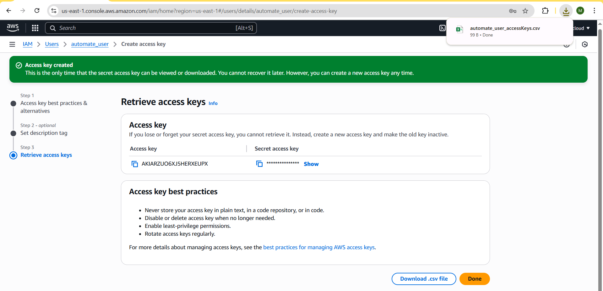
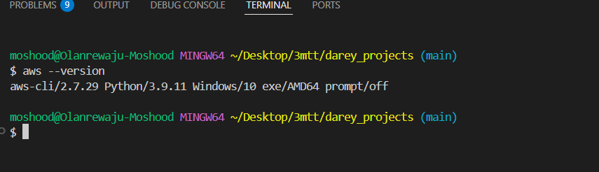
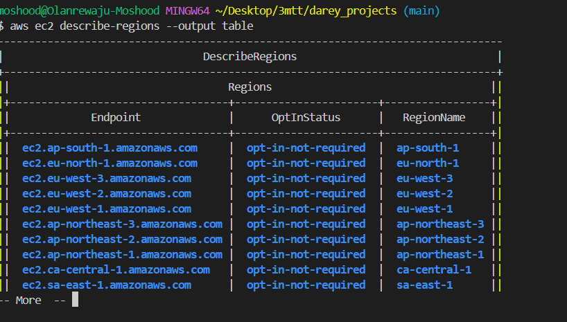

# Setting Up Secure Authentication to AWS API

The project demostrates how to set up authentication to AWs API using the following steps:

1. Creating of an IAM Role: Begin by establishing an IAM role that encapsulate the permissions required for the operation(s) you are to carry out.

2. Create an IAM policy: Design an IAM policy granting full access to both EC2 and S3 services.

3. Create an IAM User: Instantiate an IAM user named automation_user.

4. Assign the User to the IAM Role: Link the newly created user to the previously created IAM role to inherit its permissions.

5. Attach the IAM Policy to the User: Ensure that the user is explicitly granted the permissions defined in IAM policy created earlier.

6. Create Programmatic Access Credentials: Generate programmatic acess credentials -  specifically, an access key ID and a secret access key for the new user.

## Demo

1. AWS-CLI installation check

2. Configure AWS CLI # aws ec2 describe-regions --output table

