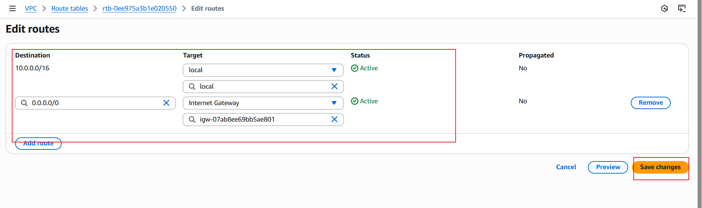
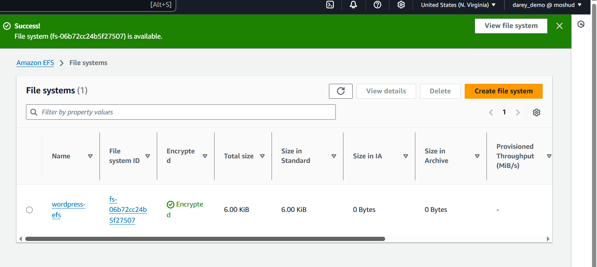

# Capstone Project: WordPress Site on AWS

## Project Scenario

A small to medium-sized digital marketing agency, "DigitalBooss", wants to enhance its online presence by creating a high-performance WordPress-based website for their clients. The agency needs a scalable, secure, and cost-effective solution that can handle increasing traffic and seamlessly integrate with thei exixting infrastructure. The task is to design and implement a WordPress solution using AWS services,such as Networking, Compute, Object Storage, and Databases.

## Project Overview

## Project Components

### 1. VPC Setup

#### Obejective

Creation of a virtual Private Cloud (VPC) that isolates and secure the WordPress infrastucture.

#### Steps

- I started the project by logging into the AWS console and navigated to the VPC page

- Then created a new VPC named "demo" using 10.0.0.0/16 CIDR address

### 2. Subnet

A subnet, short for subnetwork, is a logical subdivision of a VPC network. It is a smaller network operating within a larger network (demo VPC).

#### Steps

1. Still on the VPC dashboard, at the left side i clicked on subnets, then click on create subnet.

2. Then on the Subnet page on the VPC ID I select the VPC I create for WordPress which is vpc-0f2fb352a8b7da4f5 (demo-VPC)

3. Then I created the first subnet which is the one I used for the public IP and named it Public-subnet-1.

4. Then I clicked on Add new subnet, then I name it Public-subnet-2 which will be my second public IP on another available zone different from the first public subnet.

5. Also created the first private subnet which is Private-subnet-1.

6. Also created the second private subnet on different available zone which I named Private-subnet-2

7. After that I clicked on Create subnetand it was successful.

### Internet Gateway

An Internet Gateway is a highly available, horizontally scaled component in Amazon Web Services (AWS) that allows communication between a Virtual Private Cloud (VPC) and the internet. It enables instances in a public subnet to send and receive traffic from the internet if they have a public IPv4 or IPv6 address.

#### Steps:

1. Still on VPC dashboard, I click on Internet gateways on the left side, then click on Create internet gateway

2. Then I name the gateway as WordPress-Gateway , then I click on Create internet gateway at the bottom of the page.

3. And it was successful, then I click on Actions then click on Attach to VPC.

4. On the attach page, I selected the VPC I create for the project and click on Attach internet gateway.

### Route Tables

A Route Table is a set of rules that determines how network traffic is directed within a network. It is used in networking devices like routers and cloud environments (such as AWS Virtual Private Cloud) to define paths for data packets.

#### Steps:

1. Still on the VPC dashboard I clicked on Route tables on the left side, then clicked on Create route table.

2. And I name it demo-route-table then select the VPC I create for project and click on Create route table.

3. Then I click on the new Route Table I created, then click on Edit routes.
Then I click on Add route, and selected 0.0.0.0/0 and under Target I select Internet Gateway, then click on Save changes.

4. Then I went to Subnet Associations tab and clicked on the Edit subnet associations button.

5. Then under Available subnets I select the 2 public Subnet, then click on Save associations.

6. I create another route table for the private subnets which I named it private-demo-rt.

7. Since I will be using the subnet locally I don't need to include anothert route like I did for the other route table for public, I just associate the private subnet to the route table and save the configuration.

### Nat Gateway

A NAT Gateway (Network Address Translation Gateway) is a service that allows instances in a private subnet to connect to the internet or other AWS services while preventing unsolicited inbound connections from external sources.

#### Steps:

1. Navigated to the nat gateway section on the VPC page and clicked on 'Create Nat gateway'

2. The NAT gatewey was named demo-nat, I selected one of the private subnet, also under Connectivity type I select Public, then click on Allocate Elastic IP

3. Then I went back to the **Route Table and the edit the private route table I created for the private subnet to include the Nat Gateway.

### AWS RDS Setup

Amazon Relational Database Service (RDS) is a fully managed database service provided by AWS that simplifies the setup, operation, and scaling of relational databases in the cloud. It automates administrative tasks like backups, patching, and monitoring, allowing users to focus on their applications instead of database management.

#### Objective

To deploy and managed MySQL database using Amazon RDS for WordPress data storage.

#### Steps

1. On the search tab of the console, I search for RDS then click on Aurora and RDS.
2. After that I click on Subnet groups, this is to ensures that database instances are deployed across multiple subnets for high availability and fault tolerance.
3. Then clicked on Create DB subnet group.
4. On the subnet group page I name the group as wordpress-Subnet-Group, after that I select the VPC I create for WordPress(demo-VPC)

5. After that I added the private subnet to the group and clicked on Create.

6. Launched the RDS(mysql) instance: Still on the dashboard tab, I clicked on Databases, then click on Create database.

7. I select the following:

- `Choose a database creation method` -- Standard create
- `Engine type` -- MySQL
- `Templates` -- Free tier
- `DB instance identifier` -- WordPress-DB
- `Credentials management` -- Self managed then include my own password I generate myself.
- `Instance configuration` -- db.t4g.micro
- `Allocated storage` -- 100GB
- `Compute resource` -- Don’t connect to an EC2 compute resource
- `Network type` -- IPv$
- `Virtual private cloud (VPC)` -- WordPress-VPC (vpc-01c2ac65688fa709d)
- `DB subnet group` -- wordpress-subnet-group
- `Public access` -- No After all these I click on Create database
And it was created successfully.

8. After I went ahead to create security group that I will use for this project which I name wordpress-SG.

9. Then I went to modify the MySQL database and change the security group to the one I  just created.

### Web Server (EC2 Insance)

#### Steps

1. I navigated to the EC2 page through the console search bar and clicked on 'launch instance'

2. I named the new instance wordpress-ec2, selected Ubuntu Linux as the OS image, also under Amazon Machine Image (AMI) and SSD Volume Type which is a free tier.

3. Under Network setting I select the VPC I create for WordPress (demo VPC) and also select the one of the public subnet.

4. I then SSH into the instance

5. After that I creat another user moshood and  gave it admin privilage so that I will not be logging to root all the time for security reasons.

6. After that I update and upgrade my instance with this command

`sudo su`
`apt-get update && apt-get upgrade -y`

### EFS Setup for Wordpress Files

Amazon Elastic File System (EFS) is a fully managed, scalable file storage service in AWS that allows multiple EC2 instances to access shared storage. It is designed for high availability, durability, and elasticity, making it ideal for applications requiring shared access to files

#### Steps

1. On the AWS Console I searched for EFS then clicked on Create file system.

2. I then named it wordpress-efs, then select the VPC I create for the WordPress and select the 2 private Ip and also the  wordpress-security group.

3. Edited the wordpress security group to include the newly created EFS

4. Then I went back to my EC2 instance to mount the file system to the EC2 instance with the following command.

`sudo su`
`mkdir -p /var/www/html`
`sudo mount -t nfs4 -o nfsvers=4.1,rsize=1048576,wsize=1048576,hard,timeo=600,retrans=2,noresvport fs-025c4876baabe3wrrf5.efs.us-west-1.amazonaws.com:/ /var/www/html`

I got the below error while trying to mount the efs file

This was resolved by installing neccessary nfs tools

`sudo apt update && sudo apt install nfs-common -y`

5. After this I install apache2 since I am using ubuntu server.

`apt-get install apache2`
`sudo systemctl enable apache2`
`sudo systemctl start apache2`
`systemctl status apache2`

6. Install php 7.4

`sudo apt install -y software-properties-common`
`sudo add-apt-repository ppa:ondrej/php`
`sudo apt update`
`sudo apt install -y php7.4 php7.4-common php7.4-cli php7.4-cgi php7.4-curl php7.4-mbstring php7.4-gd php7.4-mysql php7.4-gettext php7.4-json php7.4-xml php7.4-fpm php7.4-intl php7.4-zip`

7. MYSQL installation

`wget https://dev.mysql.com/get/mysql-apt-config_0.8.24-1_all.deb`
`sudo dpkg -i mysql-apt-config_0.8.24-1_all.deb`
`sudo apt update`
`sudo apt install -y mysql-server`
`sudo systemctl enable mysql`
`sudo systemctl start mysql`

8. Set Permissions

`sudo usermod -aG www-data moshood`
`sudo chown -R moshood:www-data /var/www`
`sudo chmod 2775 /var/www && find /var/www -type d -exec sudo chmod 2775 {} \;`
`sudo find /var/www -type f -exec sudo chmod 0664 {} \;`
`sudo chown www-data:www-data -R /var/www/html`

9. Download wordpress files

`wget https://wordpress.org/latest.tar.gz`
`tar -xzf latest.tar.gz`
`sudo cp -r wordpress/* /var/www/html/`

10. Create the wp-config.php file

`sudo cp /var/www/html/wp-config-sample.php /var/www/html/wp-config.php`

### Preparing MYSQL

#### Steps

1.  I setup a strong password for MySQL database.

`sudo mysql_secure_installation`

2. Then log into MySQL

`sudo mysql -u root -p`

3. Create a Database and User for WordPress

4. Edited the wp-config.php file

`sudo nano /var/www/html/wp-config.php`

5. Then I rstart the apache2 service

`sudo systemctl restart apache2`

6. I open my browser  and input the public ip of the ec2 instance

### Application Load Balancer

#### Objective

Set up an Application Load Balancer to distribute incoming traffic among multiple instances, ensuring high availability and fault tolerance.

- Distribute traffic to multiple EC2 instances
- Ensure high availability and fault tolerance
- Integrate it with your Auto Scaling Group

#### Steps

1. On the EC2 dashboard, I clicked on Load Balancer at the left side and clicked on Create load balancer.

2. Then, I selected Application Load Balancer under Load balancer types.

3. Then, I selected the following things:

- Load balancer name -- wordpress-ALB
- Scheme -- Internet-facing
- Load balancer IP address type -- IPv4
- VPC -- WordPress-VPC
- Availability Zones and subnets -- us-west-1b (usw1-az3), us-west-1c (usw1-az1)
- Security groups  -- WordPress-SG
- Listeners and routing -- HTTP - 80, HTTPS - 443

4. Then click on Create target group

- Choose a target type -- Instances
- Target group name -- WordPress-Target
- Protocol : Port -- HTTP
- Health check protocol -- HTTP
- Health check path -- /

5. Then I attached the EC2 Instance.

6. Then I open my browser again and trynto reach the wordpress page through the ALB DNS NAME

### Auto Scaling

An Auto Scaling Group (ASG) is a feature in cloud computing that helps manage a collection of virtual machines (instances) to ensure optimal performance and cost efficiency. It automatically adjusts the number of instances based on demand, ensuring that your application has the right amount of resources at any given time.

#### Objective

Implement Auto Scaling to automatically adjust the number of instances based on traffic load.

#### Steps

1. On the EC2 dashboard I click on Launch Templates, then click on Create launch template

2. Then I select the following

- `Launch template name` -- WordPress-Template
- `Template version description` -- For wordpress instance
- `Amazon Machine Image (AMI) -- Ubuntu Server 24.04 LTS (HVM), SSD Volume Type which is the one I am using for my WordPress instance.`
- `Key pair (login)` -- WordPress-key
- `Network settings` -- I select one of my public subnet
`Firewall (security groups)` -- Also select the security group I create for WordPress instance. Then click on Create launch template.

3. On the EC2 dashboard I click on Auto scaling Groups, then click on Create Auto Scaling group.

4. Then on the Auto scaling page I name it wordpress-autoscaling, and select the template I created.

5. Then I select the VPC which is the one for WordPress and the two subnets(public).

6. Then selected the WordPress ALB, then for scaling I selected 1 for min and 3 for max.

7. Then went back to my instance ssh terminal to really check the scaling.

`sudo apt update`
`sudo apt install stress -y`
`stress --cpu 2 --timeout 300`

8. Then I click my instance to see if the Autoscaling is configured properly.

