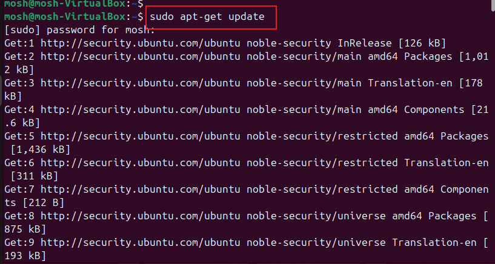

# Introduction to Docker and Containers

This project is aimed to get familiarized with the concept of Containerisation and Docker.

## What are Containers?

In the world of software development, "containers" refer to a standardized unit of software that packages up code and all its dependencies so the application runs quickly and reliably from one computing environment to another.

### Characteristics of Container

- Portability: Containers encapsulate everything an application needs to run, making it truly "write once, run anywhere." This solves the common problem of "it works on my machine" and ensures consistent behavior across development, testing, and production environments, whether on a developer's laptop, a private data center, or the public cloud.

- Lightweight and Efficient: Unlike virtual machines (VMs), which virtualize the entire hardware and include a full guest operating system for each application, containers virtualize the operating system. This means multiple containers can share the host operating system's kernel, making them much smaller in size (typically megabytes) and requiring fewer resources (CPU, memory, storage). This leads to better utilization of hardware.

- Isolation: Each container runs as an isolated process in its own user space. This prevents conflicts between applications and ensures that one application's issues don't affect others running on the same host.

- Rapid Scalability: Because they are lightweight and can start and stop quickly, containers are ideal for scaling applications up or down rapidly in response to demand.

- Improved Development Workflow (DevOps): Containers promote agility and collaboration between development and operations teams. Developers can focus on writing code, knowing that the container will provide a consistent environment for deployment. This streamlines the continuous integration and continuous deployment (CI/CD) pipelines.

- Microservices Architecture: Containers are a natural fit for microservices, where large applications are broken down into smaller, independent, and loosely coupled services. Each microservice can be packaged in its own container and deployed independently, making development, deployment, and scaling more manageable.

## Docker

Docker is a software platform that enables building, testing, and deployment of applications quickly and consistently using containers.

### How Docker Works

- Docker Image: Think of a Docker image as a blueprint or a template. It's a read-only, static package that contains your application code, its runtime (e.g., Python, Node.js, Java), system tools, libraries, and all the necessary configurations. You build an image from a Dockerfile, which is a simple text file with instructions.

- Docker Container: A Docker container is a running instance of a Docker image. It's a lightweight, isolated, and executable package that includes everything needed to run a piece of software. When you run a Docker image, it becomes a container.

- Docker Engine: This is the core software that runs on your host machine (your laptop, a server, etc.). It's a client-server application that consists of:

- Docker Daemon (dockerd): The background service that manages Docker objects like images, containers, networks, and volumes.

- Docker Client (docker CLI): The command-line tool you use to interact with the Docker daemon (e.g., docker build, docker run, docker pull).

## DEMO

1. Installing Docker
    - a. Launched my ubuntu 20.04 LTS instance

    - b. Performed update using the command below
    `sudo apt-get update`

    - c. Installed essential packages including certificate authorities, data transfer tool(curl), and the GNU privacy guard for secure communication and package.

`sudo apt-get install ca-certificates curl gnupg`

    - d. Created a directory (/etc/apt/keyrings) with specific permissions for storing keyring files which are used for docker's authentication

`sudo install -m 0755 -d /etc/apt/keyrings`

    - e. Downloaded the Docker GPG key using `curl`

`curl -fsSL https://download.docker.com/linux/ubuntu/gpg | sudo gpg --dearmor -o /etc/apt/keyrings/docker.gpg`

    - f. Set read permissions for all users on the Docker GPG key file within the APT keyring directory

`sudo chmod a+r /etc/apt/keyrings/docker.gpg`

    - g. Added the repository to Apt sources using the commands below

`echo \`
  `"deb [arch=$(dpkg --print-architecture)` `signed-by=/etc/apt/keyrings/docker.gpg] https://download.docker.com/linux/ubuntu \`
  `$(. /etc/os-release && echo "$VERSION_CODENAME") stable" | \`
  `sudo tee /etc/apt/sources.list.d/docker.list > /dev/null`

    - h. Performed update once again

`sudo apt-get update`

    - i. Installed lates verion of docker

`sudo apt-get install docker-ce docker-ce-cli containerd.io docker-buildx-plugin docker-compose-plugin`

    - j. Verified that docker has been successfully installed

`sudo systemctl status docker`

    - k. Added docker to the user sudoer group
`sudo usermod -aG docker mosh`

2. Running the "Hello World Container"

The `docker run` command is the entry point to execute containers in Docker. It allows one to create and start a container based on a specified Docker image. The most straightforward example is the "Hello world" container, a minimalistic container that prints a greeting message when executed.

`docker run hello-world`

Verifying successful execution by checking the docker images available

`docker images`

Docker commands

