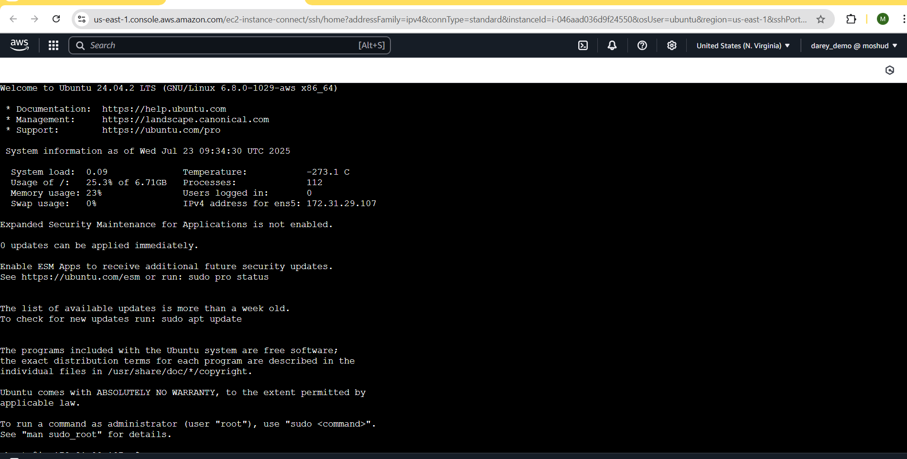
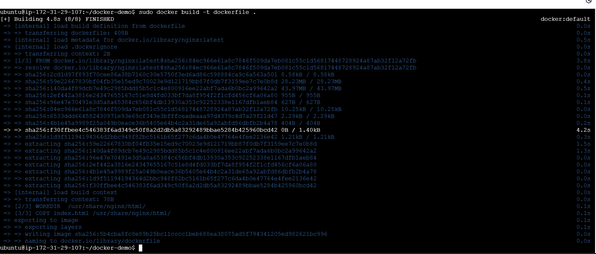
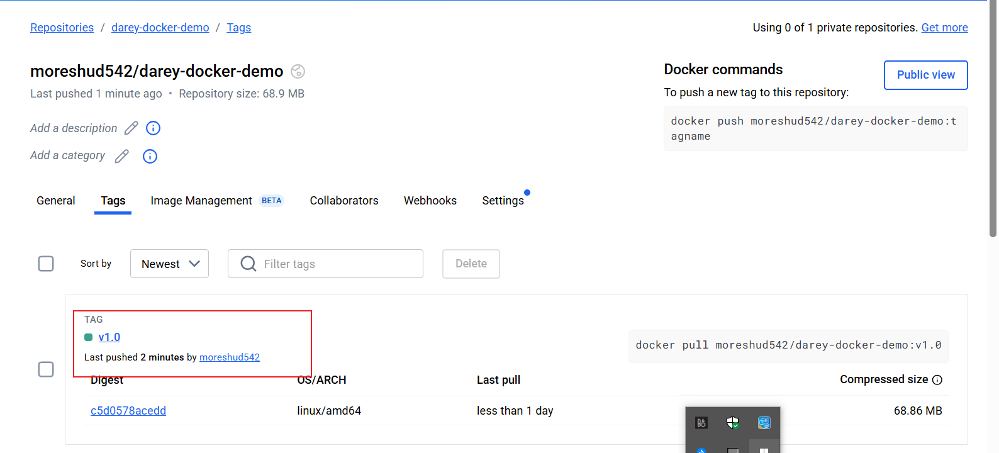

# Working with Docker Images

Docker images are the building blocks of containers. They are lightweight, portable and self-sufficient packages that contain everything needed to run a software application, including the code, runtime, libraries, and system tools. Imagrs are created from a set of instructions known as a Dockerfile, which specifies the environment and configuration for the application.

## Project Tasks

1. Launch an instance and create a Dockerfile

    - a. Launch an ubuntu EC2 instance and connected to it

    - b. Create a dockerfile

    - c. Used the official nginx image as the base image

    - d. Copied the web static page file(index.html) to the appropiate location within the container.

    - e. Exposed the port(80) of the web application.

2. Build the Docker Image

    - a. Navigated to the directory containing the Dockerfile

    - b. Build the image using the dockerfile

`docker build -t dockerfile .`

3. Run the Docker container

    - a. Update the security group to allow access on port 8080

    - b. Run the newly built image

4. Verify in Browser

5. Push image to Docker hub

