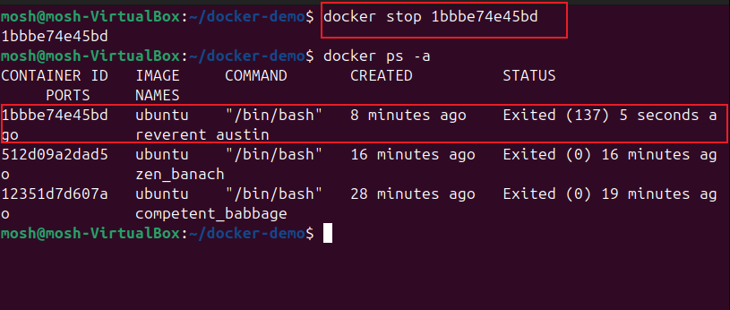

# Working with Docker Containers

Docker containers are lightweight, portable, and executable units that encapsulate an application and its dependencies.

## Docker Container Operations

1. Start a Container and run a simple command

2. Stop the Container and verify status

3. Restart the container and observe changes

4. Remove the container

