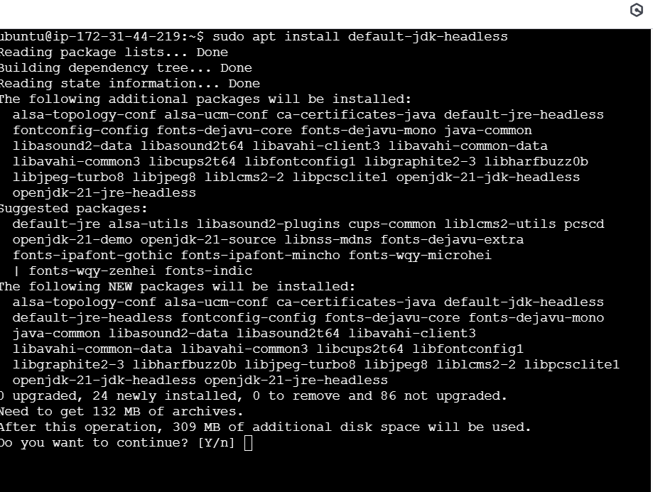
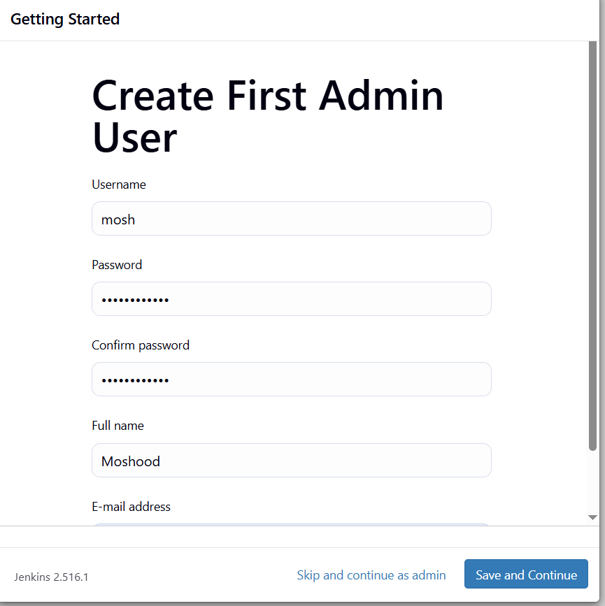
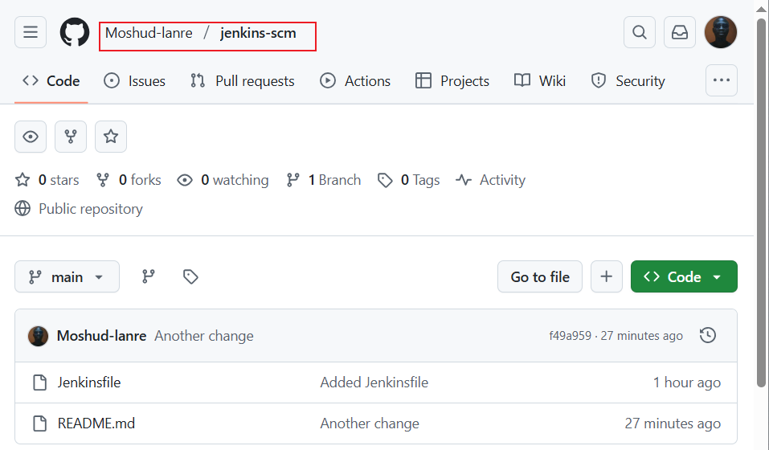
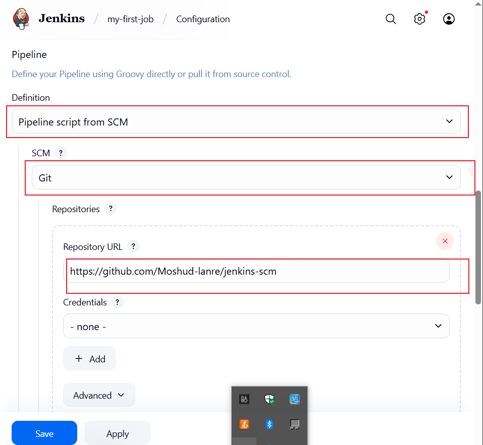
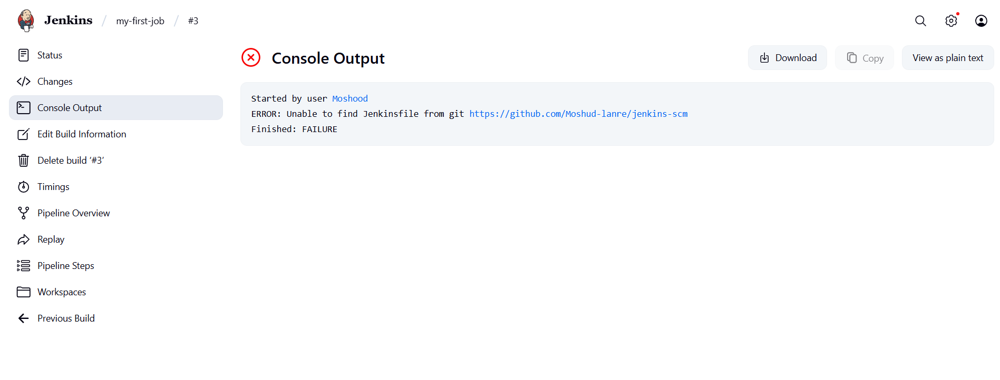
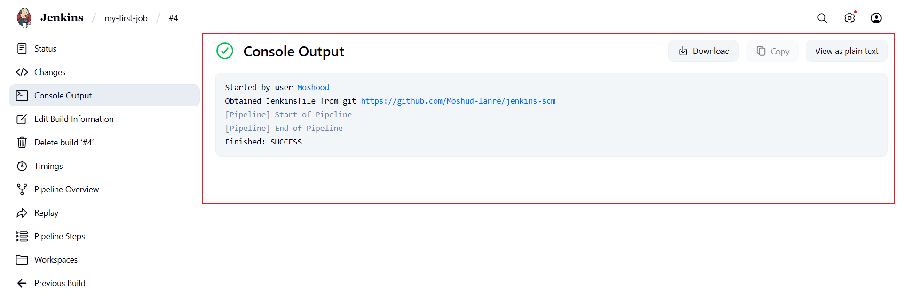
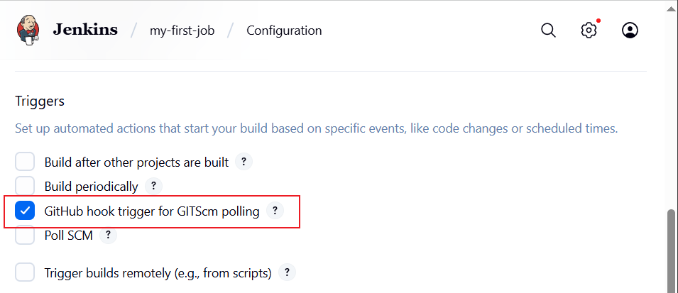
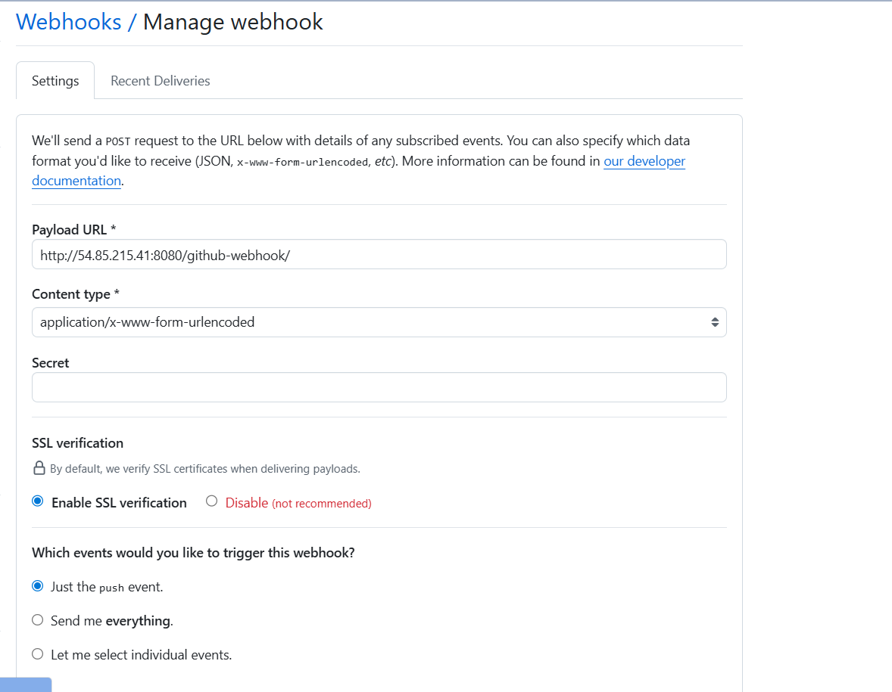
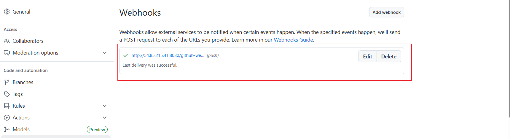

# Introduction to Jenkins

Jenkins is widely employed as a crucial CI/CD tool for automating software development processes. Teams utilize Jenkins to automate building, testing, and deploying applications, streamlining the development lifecycle. With Jenkins pipelines, developers can define, version, and execute entire workflows as code, ensuring consistent and reproducible builds. Integration with version control systems allow Jenkins to trigger builds automatically upon code changes, facilitating early detection of issues and enabling teams to deliver high-quality software at afaster pace. Jenkins' flexibilty, extensibility through plugins, and support for various tools make it a preferred choice for organizations aiming to implement efficient and automated DevOps practices.

## Jenkins Setup Demo

1. Update package repsitories

`sudo apt update`

2. Install JDK

`sudo apt install default-jdk-headless`

3. Install Jenkins

`wget -q -O - https://pkg.jenkins.io/debian-stable/jenkins.io.key | sudo apt-key add -`
    `sudo sh -c 'echo deb https://pkg.jenkins.io/debian-stable binary/ > \`
    `/etc/apt/sources.list.d/jenkins.list'`
    `sudo apt update`
    `sudo apt-get install jenkins`

4.  Check if Jenkins has been installed, and it is up and running

`sudo systemctl status jenkins`

5. Update security group settings to allow access on port 8080

6. Install suggested plugins

7. Create user account

8. Log into Jenkins console

9. Create a repo

10. Connect Jenkins to jenkins-scm repo created

11. Save configuration and run "Build now"

Error encountered when "Build now was ran

Added jenkinsfile to the repo to fix error

12. Configure Build Trigger

13. Create a github webhook using jenkins ip address and port

